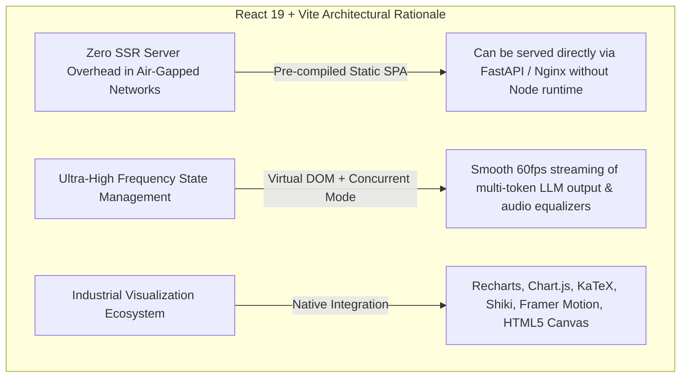
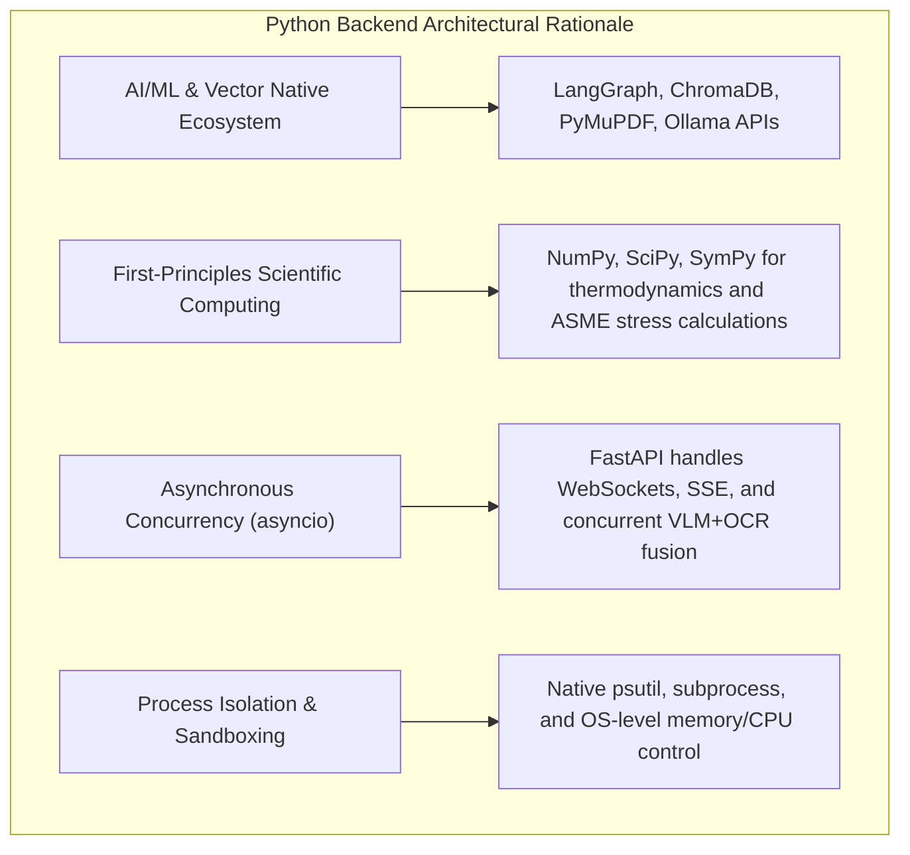
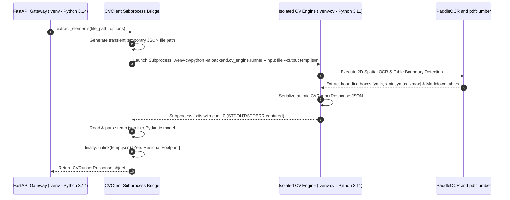
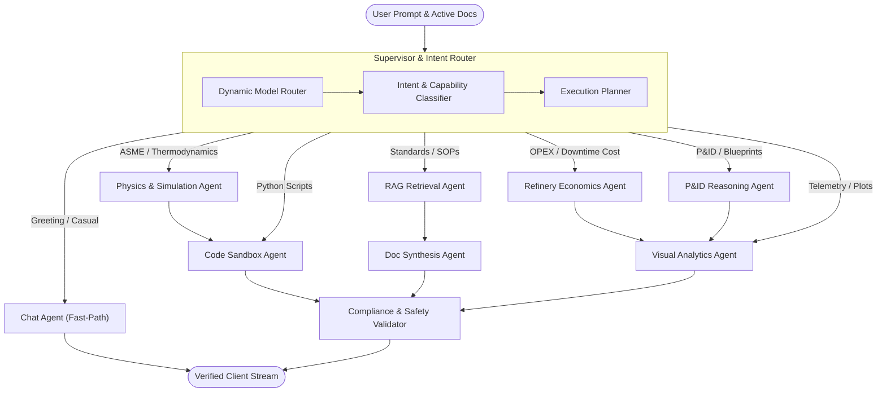
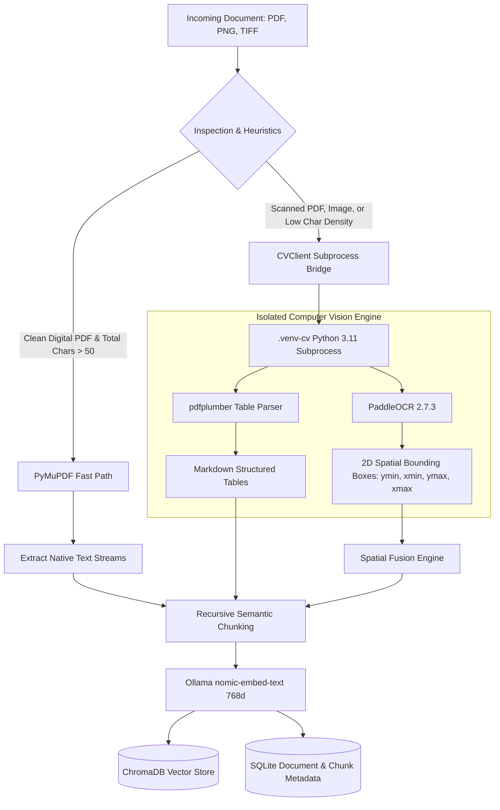
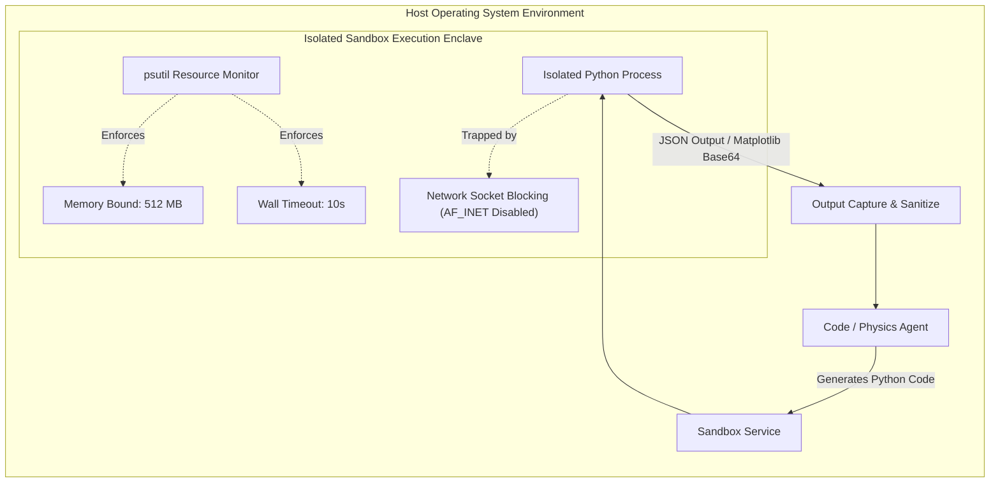
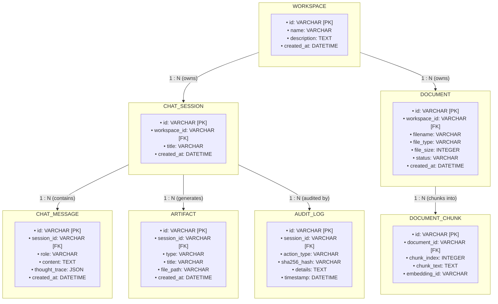

# 🛡️ Sovereign On-Premise AI Workbench (SIH26117)
## Comprehensive Technical Architecture, Design Rationale, & Product Specification

---

## 1. Executive Summary & Product Vision

### 1.1 The Industrial Challenge
In mission-critical industrial facilities—such as petroleum refineries (e.g., Mangalore Refinery & Petrochemicals Limited - MRPL), chemical processing plants, nuclear facilities, and offshore platforms—generic consumer AI models (such as cloud-hosted ChatGPT, Claude, or Gemini) are fundamentally non-viable due to four critical bottlenecks:
1. **Zero-Egress Regulatory Mandates**: Strict industrial safety and national security regulations (OISD-156, OSHA 1910.119, ASME Section VIII) prohibit transmitting proprietary telemetry, piping diagrams, hazard analyses (HAZOP), or operational logbooks across public internet infrastructure.
2. **First-Principles Physics & Precision**: Standard LLMs hallucinate complex thermodynamic and mechanical calculations (e.g., ASME Section VIII wall thickness, Larson-Miller creep rupture life, Darcy-Weisbach pressure drop).
3. **Engineering Blueprint Complexity**: Industrial documentation consists of complex Piping & Instrumentation Diagrams (P&IDs), dense technical tables, and scanned equipment specifications where spatial relationships and tag identifiers (`B-401`, `PRV-102`, `CV-401`) are paramount.
4. **Operational Economics Disconnect**: Technical anomalies directly translate into commercial downtime penalties (e.g., unplanned crude unit shutdown costs of \$50,000+/hour). Standard AI tools lack financial modeling to evaluate business impact.

### 1.2 What We Are Building
The **Sovereign On-Premise AI Workbench** is an air-gapped, sovereign, multi-agent AI engineering command center designed to function entirely on-premise without a single byte escaping the local enterprise network. 

The system unifies:
- **Local Neural Inference Enclave**: 100% offline LLMs, Vision-Language Models (VLMs), and dense embeddings executed via an on-premise Ollama instance.
- **Heterogeneous Dual-Python Engine**: A modern Python 3.14 async gateway paired with an isolated Python 3.11 Computer Vision worker for 2D spatial text/table extraction.
- **Autonomous Multi-Agent Swarm**: A LangGraph-orchestrated team of specialized agents (Supervisor, RAG, Code Sandbox, Physics/Thermodynamics, Operational Economics, P&ID Canvas, Visual Analytics, and Compliance Validator).
- **High-Fidelity "Darkroom Studio" UI**: A dedicated React 19 Single Page Application featuring draggable fluid split-views, real-time WebSocket telemetry streaming, interactive SVG P&ID canvases, dynamic financial charts, KaTeX mathematical typesetting, and air-gapped audio capture.

---

## 2. Core Architecture & System Topology

The system operates across three tightly decoupled tiers: the **Client Interface (Frontend)**, the **Sovereign Gateway & CV Worker (Backend)**, and the **Local Inference Enclave (Ollama)**.

### 2.1 End-to-End System Topology Diagram

```
┌────────────────────────────────────────────────────────────────────────────────────────────────────────┐
│                        1. CLIENT LAYER — DARKROOM STUDIO (REACT 19 + VITE SPA)                         │
│  ┌─────────────────────────┐  ┌───────────────────────────┐  ┌──────────────────────────────────────┐  │
│  │   Split-View Chat       │  │   Split-View Artifact     │  │   Interactive Process & P&ID Canvas  │  │
│  │   • Token Stream Parser │  │   • Code Editor / Preview │  │   • Dynamic Zoom/Pan & Node Flyout   │  │
│  │   • Agent Thought Trace │  │   • Technical Doc Viewer  │  │   • Real-Time Equipment Highlighting │  │
│  └────────────┬────────────┘  └─────────────┬─────────────┘  └──────────────────┬───────────────────┘  │
│               │                             │                                   │                      │
│  ┌────────────┴─────────────────────────────┴───────────────────────────────────┴───────────────────┐  │
│  │   Universal Input Enclave: Real-Time Audio Equalizer, Air-Gapped Whisper & WebSocket Bus        │  │
│  └──────────────────────────────────────────┬───────────────────────────────────────────────────────┘  │
└─────────────────────────────────────────────┼──────────────────────────────────────────────────────────┘
                                              │  WebSocket (ws://) & REST (http://)
                                              ▼
┌────────────────────────────────────────────────────────────────────────────────────────────────────────┐
│                     2. SOVEREIGN GATEWAY LAYER — MAIN BACKEND (.venv PYTHON 3.14)                      │
│  ┌──────────────────────────────────────────────────────────────────────────────────────────────────┐  │
│  │  FastAPI Async Gateway (:8000)  ──▶  Zero-Egress Interceptor Middleware (Network Air-Gap Enforced) │  │
│  └──────────────────┬───────────────────────────────────┬───────────────────────────────────────────┘  │
│                     │                                   │                                              │
│       ┌─────────────┴────────────┐       ┌──────────────┴──────────────┐       ┌────────────────────┐  │
│       │ Document Ingestion Svc   │       │ Spatial Vision Fusion Svc   │       │ Code Sandbox Svc   │  │
│       │ • PyMuPDF Native Parser  │       │ • Concurrent asyncio.gather │       │ • Isolated Subproc │  │
│       │ • Recursive Chunking     │       │ • IoB / IoU Tag Enrichment  │       │ • 512MB RAM Limit  │  │
│       └─────────────┬────────────┘       └──────────────┬──────────────┘       │ • 10s Wall Timeout │  │
│                     │                                   │                      └────────────────────┘  │
│                     │                                   │                                              │
│                     ▼                                   ▼                                              │
│       ┌──────────────────────────┐       ┌─────────────────────────────┐                               │
│       │ ChromaDB Vector Store    │       │ CVClient Subprocess Bridge  │                               │
│       │ (768d Dense Embeddings)  │       │ (IPC via Transient JSON)    │                               │
│       └──────────────────────────┘       └──────────────┬──────────────┘                               │
└─────────────────────────────────────────────────────────┼──────────────────────────────────────────────┘
                                                          │  Subprocess JSON IPC Bridge
                                                          ▼
┌────────────────────────────────────────────────────────────────────────────────────────────────────────┐
│                        3. ISOLATED COMPUTER VISION ENGINE (.venv-cv PYTHON 3.11)                       │
│  ┌───────────────────────────────────────────────┐   ┌──────────────────────────────────────────────┐  │
│  │  PaddleOCR 2.7.3 Engine (ch_PP-OCRv4)         │   │  pdfplumber Structural Table Extractor       │  │
│  │  • 2D Spatial Text Bounding Boxes             │   │  • Precise Grid & Cell Boundary Detection    │  │
│  │  • [ymin, xmin, ymax, xmax] Normalization     │   │  • Structured Markdown Table Formatting      │  │
│  └───────────────────────────────────────────────┘   └──────────────────────────────────────────────┘  │
└────────────────────────────────────────────────────────────────────────────────────────────────────────┘
                                              ▲
                                              │  Multi-Agent Coordination & Reasoning
                                              ▼
┌────────────────────────────────────────────────────────────────────────────────────────────────────────┐
│                       4. INTELLIGENCE & INFERENCE TIER (LANGGRAPH & LOCAL OLLAMA)                      │
│  ┌──────────────────────────────────────────────────────────────────────────────────────────────────┐  │
│  │  Supervisor & Dynamic Model Router                                                               │  │
│  │  ├─▶ RAG Retrieval Agent       ──▶ Ingests MRPL SOPs, ASME Standards & Active Workspaces        │  │
│  │  ├─▶ Physics & Math Agent      ──▶ Evaluates ASME Section VIII Wall Thickness & Creep Life       │  │
│  │  ├─▶ Refinery Economics Agent  ──▶ Computes Fuel Gas, Steam Costs & Turnaround Downtime Penalties│  │
│  │  ├─▶ P&ID Reasoning Agent      ──▶ Resolves Equipment Flow Topology & Cross-Validates Tags       │  │
│  │  ├─▶ Visual Analytics Agent    ──▶ Compiles Structured JSON Telemetry for Dynamic Recharts       │  │
│  │  ├─▶ Code Sandbox Agent        ──▶ Executes Sandboxed Python Verification Scripts                │  │
│  │  └─▶ Compliance Validator      ──▶ Final Automated Safety Clearance against Industrial Standards │  │
│  └──────────────────────────────────────────────────┬───────────────────────────────────────────────┘  │
│                                                     │  Local Ollama Enclave (:11434)                   │
│  ┌───────────────────────────────┐   ┌──────────────┴────────────────┐   ┌──────────────────────────┐  │
│  │ Reasoning: Llama 3.1 8B       │   │ Multimodal: Qwen2-VL 7B       │   │ Embeddings: Nomic 768d   │  │
│  └───────────────────────────────┘   └───────────────────────────────┘   └──────────────────────────┘  │
└────────────────────────────────────────────────────────────────────────────────────────────────────────┘
```

#### Detailed Component Flow (Mermaid Interactive Specification)

```mermaid
graph TB
    %% Client Tier
    subgraph ClientTier["1. Client Layer - Darkroom Studio (React 19 + Vite)"]
        UI_Chat["Split-View Chat Stream"]
        UI_Artifact["Artifact Studio (Markdown, Docx, Code)"]
        UI_Canvas["Interactive P&ID & Process Canvas"]
        UI_Charts["Dynamic Visual Analytics (Chart.js / Recharts)"]
        UI_Audio["Air-Gapped Audio Equalizer & Mic Capture"]
        UI_Term["Live Code Editor & Subprocess Terminal"]
    end

    %% Gateway Tier
    subgraph GatewayTier["2. Gateway Layer - Main Backend (.venv Python 3.14)"]
        FastAPI["FastAPI Async Gateway (Port 8000)"]
        ZeroEgress["Zero-Egress Interceptor & Network Sandbox"]
        AuthService["JWT Session & RBAC Controller"]
        AuditLogger["Cryptographic SHA-256 Audit Logger"]
        IngestSvc["Document Ingestion Engine (PyMuPDF Fast-Path)"]
        VisionSvc["Spatial Vision Fusion Service"]
        CVClient["CVClient Subprocess IPC Bridge"]
        SandboxSvc["Isolated Python Execution Sandbox (psutil)"]
        SQLiteDB[("SQLite Database - Audit, Chats, Artifacts")]
        ChromaDB[("ChromaDB Vector Store - Embeddings")]
    end

    %% CV Worker Tier
    subgraph CVWorkerTier["3. Isolated CV Engine - (.venv-cv Python 3.11)"]
        Runner["backend.cv_engine.runner (CLI Entrypoint)"]
        PaddleOCR["PaddleOCR 2.7.3 (PP-OCRv4 2D Spatial Boxes)"]
        PDFPlumber["pdfplumber (Structural Table Extraction)"]
        OpenCV["OpenCV Headless (Image Normalization)"]
    end

    %% Agent Intelligence Tier
    subgraph IntelligenceTier["4. Intelligence Layer - Multi-Agent Swarm (LangGraph)"]
        Supervisor["Supervisor & Dynamic Model Router"]
        RAGAgent["RAG Retrieval Agent"]
        PhysicsAgent["Physics & Thermodynamic Simulator"]
        EconAgent["Refinery Economics & OPEX Agent"]
        PIDAgent["P&ID Schematic Reasoning Agent"]
        AnalyticsAgent["Visual Analytics & Chart Agent"]
        CodeAgent["Code Generation & Sandbox Agent"]
        DocAgent["Technical Document Synthesis Agent"]
        ValidatorAgent["ASME / OISD Compliance Validator"]
    end

    %% Local Inference Tier
    subgraph InferenceTier["5. Inference Enclave - Air-Gapped Ollama (Port 11434)"]
        LLM_Reasoning["Reasoning LLM (Llama 3.1 8B / Qwen 2.5 7B)"]
        VLM_Vision["Multimodal VLM (Qwen2-VL 7B Instruct)"]
        Embed_Model["Dense Embeddings (Nomic-Embed-Text 768d)"]
    end

    %% Client to Gateway Interconnections
    UI_Chat <-->|"WebSocket & REST"| FastAPI
    UI_Canvas <-->|"Vector / Coordinates"| FastAPI
    UI_Audio -->|"PCM Audio Stream"| FastAPI

    %% Gateway Internal Flow
    FastAPI --> ZeroEgress
    FastAPI --> AuthService
    FastAPI --> AuditLogger
    AuditLogger --> SQLiteDB
    FastAPI --> IngestSvc
    FastAPI --> VisionSvc
    FastAPI --> SandboxSvc

    IngestSvc -->|"Native Text PDFs"| PyMuPDF_Fast["PyMuPDF Native Parser"]
    IngestSvc -.->|"Scanned / Image / Tables"| CVClient
    PyMuPDF_Fast --> ChromaDB

    VisionSvc <-->|"Concurrent asyncio.gather"| CVClient
    VisionSvc <-->|"Concurrent asyncio.gather"| VLM_Vision

    CVClient <-->|"Subprocess JSON IPC"| Runner
    Runner --> PaddleOCR
    Runner --> PDFPlumber
    Runner --> OpenCV

    FastAPI <-->|"State Stream"| Supervisor
    Supervisor --> RAGAgent
    Supervisor --> PhysicsAgent
    Supervisor --> EconAgent
    Supervisor --> PIDAgent
    Supervisor --> AnalyticsAgent
    Supervisor --> CodeAgent
    Supervisor --> DocAgent
    Supervisor --> ValidatorAgent

    RAGAgent --> ChromaDB
    RAGAgent --> Embed_Model
    Supervisor --> LLM_Reasoning
    PhysicsAgent --> SandboxSvc
```



---

## 3. Technology Stack Justification & Rationale

A foundational requirement of this project is deliberate architectural selection. Every tool, framework, and language was chosen based on industrial engineering constraints rather than convention.

### 3.1 Why React (and ONLY React) for the Frontend?

The frontend is built using **React 19 + Vite**, rejecting full-stack frameworks (like Next.js/Remix) and alternative component frameworks (Vue/Angular/Svelte).



#### Detailed Rationale Matrix: Frontend Framework Selection

| Factor | React 19 + Vite (Chosen) | Next.js / Remix (SSR) | Vue.js / Angular |
|---|---|---|---|
| **Air-Gap Operational Simplicity** | **Optimal**: Compiles into static HTML/JS/CSS assets. Can be served directly by FastAPI or Nginx without running a Node.js daemon in production. | **Poor**: Requires a persistent Node.js runtime container inside the air-gapped server cluster, doubling infrastructure maintenance. | **Moderate**: Compiles statically, but lacks the depth of the React ecosystem for specialized scientific tools. |
| **High-Frequency Real-Time Streaming** | **Optimal**: React 19 concurrent features and granular component hooks seamlessly ingest multi-agent WebSocket events, token streams, and live mic FFT audio buffers without frame drops. | **Overkill**: Server-side rendering provides zero advantage for an authenticated, real-time interactive engineering dashboard. | **Moderate**: Good reactivity, but smaller ecosystem for concurrent streaming primitives and low-level canvas abstractions. |
| **Scientific & Visual Canvas Ecosystem** | **Unrivaled**: Direct access to `recharts`, `react-chartjs-2`, `katex`, `shiki`, and `framer-motion`. Drag-and-drop split resizers and custom SVG schematics are native React components. | **Fragmented**: SSR hydration mismatches frequently occur with dynamic canvas, Shiki syntax highlighters, and local storage state. | **Constrained**: Limited wrappers for advanced engineering chart zoom/pan and mathematical formula rendering. |
| **State Complexity (Split-View Studio)** | **Superior**: Complex bi-directional synchronization between Chat, Artifact Preview, Code Editor, and P&ID Canvas requires decoupled client-side state trees. | **Impeded**: Route-based server components introduce unnecessary network latency for UI drawer and panel resizes. | **Manageable**: Pinia/Vuex handles state well, but community support for complex multi-pane workbench layouts is smaller. |

### 3.2 Why Python for the Entire Backend & AI Gateway?

Python is selected as the exclusive language for the backend gateway, AI orchestration, scientific computation, and computer vision.



#### Detailed Rationale Matrix: Backend Language Selection

| Factor | Python 3.14 + 3.11 (Chosen) | Node.js / TypeScript | Go (Golang) | Rust |
|---|---|---|---|---|
| **AI / Machine Learning Ecosystem** | **Monopolistic Dominance**: Native home of LangGraph, LangChain, ChromaDB, PaddleOCR, PyMuPDF, PyTorch, and Ollama drivers. | **Deficient**: Wrappers are second-class citizens, often out-of-date or reliant on native C++ bridges. | **Severely Limited**: Minimal native ML tooling; relies on CGO or REST calls. | **Nascent**: High performance, but lacks mature high-level agentic orchestration frameworks. |
| **Scientific & Thermodynamic Computation** | **Native Precision**: First-principles physical equations (ASME Section VIII, Darcy friction, Larson-Miller creep) use `numpy`, `scipy`, and `sympy` directly. | **Inadequate**: JavaScript standard floating point precision is unsuitable for safety-critical mechanical engineering. | **Moderate**: Fast math, but requires writing complex thermodynamic equations from scratch without scientific libraries. | **Fast but Cumbersome**: Excellent math performance, but extreme development overhead for rapid engineering changes. |
| **Computer Vision & OCR** | **Industry Standard**: PaddleOCR, OpenCV, and `pdfplumber` have primary, highly-optimized C-extension interfaces in Python. | **Unusable**: No viable production OCR equivalent with 2D bounding box and table extraction capabilities. | **Poor**: OCR requires shelling out to Tesseract, which lacks deep learning spatial extraction. | **Poor**: Extremely limited mature computer vision document parsing libraries. |
| **I/O & Concurrency Performance** | **High Concurrency**: Python 3.14 with `asyncio` and `uvicorn` serves thousands of concurrent WebSocket connections and handles non-blocking IPC with ease. | **High**: Excellent event loop, but lacks the ML execution context. | **Exceptional**: Goroutines are fast, but lack the agentic ecosystem. | **Exceptional**: Maximum performance, but development velocity is 5x slower. |

---

## 4. The Heterogeneous Dual-Python Environment Setup

A standout engineering feat of this workbench is the **Heterogeneous Dual-Python Environment**.

### 4.1 The Technical Dilemma
Modern web frameworks and vector stores (`FastAPI>=0.110`, `aiosqlite`, `SQLAlchemy 2.0`, `ChromaDB 0.4.24`) run optimally on modern Python runtimes (**Python 3.14**), benefiting from enhanced memory management and async loop optimizations.

Conversely, state-of-the-art Computer Vision engines:
- `paddlepaddle>=2.6.0,<3.0.0`
- `paddleocr==2.7.3`
- `opencv-python-headless>=4.8.0`
- `numpy<2.0.0`

are tightly bound to specific C-extension ABI binaries compiled strictly for **Python 3.11**. Attempting to run PaddleOCR inside Python 3.14 results in immediate C-extension DLL initialization crashes and numpy ABI incompatibilities.

### 4.2 The Solution: Decoupled Subprocess IPC Bridge
Rather than downgrading the entire backend to legacy runtimes or introducing heavy Docker container overhead inside client air-gapped environments, the workbench employs an **On-Demand Subprocess IPC Bridge**:



#### Advantages of the On-Demand Subprocess Bridge:
1. **Zero Memory Bloat**: PaddleOCR and OpenCV model weights are loaded into VRAM/RAM only during document processing and freed immediately upon subprocess exit.
2. **Binary Isolation**: Python 3.14 and Python 3.11 never share heap memory, DLL spaces, or conflicting `numpy` C-headers.
3. **No Persistent Daemon Required**: Avoids orphaned background worker daemons that consume server resources when no documents are being ingested.
4. **Air-Gap Cleanliness**: Ephemeral JSON IPC artifacts are immediately unlinked in a `finally` block, leaving zero persistent unencrypted intermediate files.

---

## 5. Multi-Agent Swarm Orchestration (LangGraph)

At the core of the workbench's intelligence is a specialized multi-agent graph powered by **LangGraph**. The system eschews monolithic prompts in favor of specialized, role-specific agents that coordinate deterministically.

```
┌──────────────────────────────────────────────────────────────────────────────────────────────────────┐
│                                   USER PROMPT & ACTIVE WORKSPACE DOCS                                │
└───────────────────────────────────────────────────┬──────────────────────────────────────────────────┘
                                                    ▼
┌──────────────────────────────────────────────────────────────────────────────────────────────────────┐
│                               SUPERVISOR NODE & DYNAMIC MODEL ROUTER                                 │
│  ┌─────────────────────────┐          ┌───────────────────────────┐         ┌─────────────────────┐  │
│  │ Model Registry Lookup   │   ──▶    │ Intent / Domain Classifier│   ──▶   │ Execution Planner   │  │
│  └─────────────────────────┘          └───────────────────────────┘         └──────────┬──────────┘  │
└───────────────────────────────────────────────────┬────────────────────────────────────┼─────────────┘
                                                    │                                    │
                ┌───────────────────────────────────┴─────────────────┐                  │
                ▼                                                     ▼                  ▼
┌───────────────────────────────┐     ┌────────────────────────────────────────────────────────────────┐
│   CHAT AGENT (FAST-PATH)      │     │ SPECIALIZED REFINERY MULTI-AGENT SWARM                         │
│   • Conversational Greetings  │     │                                                                │
│   • Instant Response Stream   │     │ 1. RAG Retrieval Agent      ──▶ Ingests SOPs & ASME Standards  │
│   • Zero Tool Execution Cost  │     │ 2. Physics / Math Agent     ──▶ ASME Sec VIII & Creep Formulae │
└───────────────┬───────────────┘     │ 3. Refinery Economics Agent ──▶ OPEX & Unplanned Downtime Cost │
                │                     │ 4. P&ID Blueprint Agent     ──▶ Equipment Tags & Spatial Flow  │
                │                     │ 5. Visual Analytics Agent   ──▶ Dynamic JSON Rechart Engine    │
                │                     │ 6. Code Sandbox Agent       ──▶ Python Subprocess Sandbox      │
                │                     │ 7. Doc Synthesis Agent      ──▶ Generates DOCX / PDF Memos     │
                │                     └───────────────────────────────┬────────────────────────────────┘
                │                                                     │
                │                                                     ▼
                │                     ┌────────────────────────────────────────────────────────────────┐
                │                     │ ASME & OISD COMPLIANCE VALIDATOR                               │
                │                     │ • Checks MAWP Safety Bounds & Temperature Creep Limits         │
                │                     │ • Validates Mandatory Citations Against Primary Source Chunks  │
                │                     └───────────────────────────────┬────────────────────────────────┘
                │                                                     │
                ▼                                                     ▼
┌──────────────────────────────────────────────────────────────────────────────────────────────────────┐
│                                   VERIFIED CLIENT WEBSOCKET STREAM                                   │
└──────────────────────────────────────────────────────────────────────────────────────────────────────┘
```

#### Detailed State Transition Graph (Mermaid Specification)



### 5.1 Agent Profiles & Responsibilities

| Agent Name | Core Capability | Typical Triggers | Underlying Model / Tools |
|---|---|---|---|
| **Supervisor** | Intent classification, model routing, execution planning | Every incoming query | Dynamic Model Router + Llama 3.1 8B |
| **RAG Agent** | Dense semantic vector search + keyword retrieval over company docs | "SOP", "MAWP", "inspection interval", "ASME standard", active documents | ChromaDB + `nomic-embed-text` (768d) |
| **Physics Agent** | First-principles engineering physics, stress, creep life, thermodynamics | "wall thickness", "hoop stress", "creep life", "Larson-Miller", "UG-27" | SciPy, SymPy, NumPy in Execution Sandbox |
| **Economics Agent** | Refinery operational economics, downtime cost, fuel gas penalties | "steam cost", "downtime penalty", "OPEX", "payback", "margin loss" | Industrial financial heuristics + Python Math |
| **P&ID Agent** | Schematic node resolution, equipment connectivity, tag correlation | "P&ID", "flow diagram", "CV-401", "relief valve", "schematic" | Qwen2-VL 7B + PaddleOCR spatial tags |
| **Analytics Agent** | Structured telemetry visualization, dynamic interactive charts | "chart", "plot", "trend", "distribution", "breakdown", "time-series" | Structured JSON schema -> Recharts / Chart.js |
| **Code Agent** | Python script synthesis, sandboxed execution, data manipulation | "simulate", "calculate and plot", "degradation curve", "script" | Isolated Python 3.14 Sandbox (`psutil`) |
| **Doc Agent** | Formal industrial document generation (.docx, .pdf, markdown) | "create doc", "draft report", "export SOP", "generate formal memo" | `python-docx`, WeasyPrint, Markdown AST |
| **Validator Agent** | Cross-verification of calculations against ASME/OISD safety limits | Automatically triggered after any technical calculation or document draft | ASME Section VIII Div 1 lookup tables |

---

## 6. Document Ingestion & Spatial Vision Pipeline

Industrial documents arrive in two distinct forms: **clean digital vectors** and **degraded scanned blueprints / technical tables**. The workbench routes these through a hybrid, multi-stage pipeline.



### 6.1 Hybrid VLM + OCR Spatial Fusion Algorithm
When analyzing complex engineering diagrams (such as P&IDs or electrical schematics), purely text-based OCR loses visual layout context, while Vision-Language Models (VLMs like Qwen2-VL) frequently hallucinate exact alphanumeric equipment tags.

The workbench implements a **Deterministic Spatial Fusion Algorithm**:
1. **Concurrent Processing**: The gateway executes Qwen2-VL and PaddleOCR simultaneously using `asyncio.gather(..., return_exceptions=True)`.
2. **IoB & IoU Geometric Association**: For every detected text tag from PaddleOCR, it calculates the **Intersection over Bounding Box** ($\text{IoB}$) and **Intersection over Union** ($\text{IoU}$) against all visual elements identified by Qwen2-VL:
   $$\text{IoB} = \frac{\text{Area}(B_{\text{OCR}} \cap B_{\text{VLM}})}{\text{Area}(B_{\text{OCR}})}$$
3. **Deterministic Tag Enrichment**: If $\text{IoB} \ge 0.50$ or $\text{IoU} \ge 0.20$, the VLM element is unambiguously enriched with the exact alphanumeric string extracted by PaddleOCR without altering the geometric bounding coordinates.
4. **Resilient Triple-Fallback**:
   - If PaddleOCR times out: returns raw Qwen2-VL visual detections.
   - If Qwen2-VL fails: returns PaddleOCR spatial text blocks.
   - If both fail: activates deterministic domain fallback schematics (e.g., standard ASME P&ID nodes).

---

## 7. Isolated Code Execution Sandbox & Zero-Egress Security

Industrial security demands total assurance that code synthesized by AI agents cannot compromise host systems or exfiltrate sensitive data.



### 7.1 Multi-Layered Security Architecture

| Security Layer | Implementation Mechanism | Purpose |
|---|---|---|
| **Network Isolation** | `ZeroEgressInterceptorMiddleware` in FastAPI | Intercepts all outbound HTTP/socket calls; blocks any traffic outside `127.0.0.1`, `localhost`, and internal enclave ports. |
| **Execution Sandboxing** | `backend/app/services/sandbox_service.py` | Runs agent-generated Python scripts in a spawned subprocess restricted by `psutil` with hard-coded 10-second timeouts and 512MB RAM ceiling. |
| **Cryptographic Audit Trail** | SHA-256 Hashed Audit Logger | Every prompt, agent routing decision, sandbox execution stdout, and document retrieval is hashed and written to a non-volatile SQLite audit log. |
| **Token-Based Authentication** | JWT with RBAC (Role-Based Access Control) | Protects all REST endpoints and WebSocket channels (`ADMIN`, `ENGINEER`, `OPERATOR`). |
| **Air-Gapped Speech Capture** | Local Whisper / Web Audio API | Voice commands are converted to audio waveforms client-side and transcribed using local CPU/GPU speech models with zero external cloud API transmission. |

---

## 8. Frontend Engineering: Darkroom Studio Experience

The user interface is engineered to replicate the focus, precision, and ergonomics of a high-end industrial darkroom instrumentation suite.

```
┌────────────────────────────────────────────────────────────────────────────────────────────────────────┐
│ 🛡️ SOVEREIGN INDUSTRIAL WORKBENCH                                               [● AIR-GAP ENFORCED]   │
├────┬──────────────────────────────────────────┬────────────────────────────────────────────────────────┤
│ ☰  │ 💬 CHAT STREAM & MULTI-AGENT TRACE        │ 📄 ARTIFACT STUDIO / LIVE CANVAS                       │
│    ├──────────────────────────────────────────┼────────────────────────────────────────────────────────┤
│ 🗂️ │ User: "Calculate ASME wall thickness for │ ┌────────────────────────────────────────────────────┐ │
│ Prj│ B-401 boiler at 450°C and 3.2 MPa."      │ │ ⚛️ ASME Section VIII Div 1 Calculation             │ │
│    │                                          │ │ Formula: t = (P * R) / (S * E - 0.6 * P) + CA     │ │
│ 📚 │ 🤖 Multi-Agent Swarm (Llama 3.1 8B):     │ │                                                    │ │
│ Lib│ • RAG Agent: Retrieved SOP-401           │ │ Inputs:                                            │ │
│    │ • Physics Agent: S=118 MPa, E=1.0, CA=3mm│ │ • Design Pressure (P): 3.2 MPa                     │ │
│ ⚙️ │ • Code Agent: Executed simulation script │ │ • Inside Radius (R): 750 mm                        │ │
│ Set│ • Validator: Margin of Safety = 1.42x    │ │ • Allowable Stress (S): 118.0 MPa                  │ │
│    │                                          │ │ Result: Minimum Wall Thickness t = 23.48 mm        │ │
│    │ [ Interactive Degradation Curve ]        │ └────────────────────────────────────────────────────┘ │
│    │  Pressure vs Temperature Limit Line      │ [📊 Dynamic Recharts] [🗺️ Interactive P&ID Canvas]     │
│    │  ● Current: 3.2 MPa / 450°C (SAFE)       │ [💻 Syntax-Highlighted Python Code] [📝 Word DOCX]    │
├────┴──────────────────────────────────────────┴────────────────────────────────────────────────────────┤
│ 🎙️ [● REC] ▇ ▅ █ ▃ ▅ █ (Air-Gapped Mic) │ Input prompt or engineering directive...           [SEND]   │
└────────────────────────────────────────────────────────────────────────────────────────────────────────┘
```

### 8.1 Key UI Capabilities:
1. **Draggable Fluid Split View**: Snappable split pane between the conversation trace and the generated artifact studio with double-click reset and boundary clamping.
2. **Compact 56px Icon Rail (`⌘B` / `Ctrl+B`)**: Maximizes workspace width while providing instant navigation across Chats, Projects, Knowledge Library, and System Settings.
3. **Interactive Visual Canvas**: Renders real-time dynamic Recharts, interactive P&ID nodes with flyout operational limits, and KaTeX mathematical proofs.
4. **Dual-Pane Code & Terminal Enclave**: Side-by-side view of generated Python code and real-time execution stdout/stderr with memory consumption metrics.

---

## 9. Comprehensive Database Schemas & Storage Hierarchy

All state is preserved locally across SQLite and ChromaDB vector collections.

### 9.1 Storage Directory Structure
```
SIH_26_WORKBENCH_AI/
├── backend/
│   └── storage/
│       ├── workbench.db        # Primary SQLite relational database (WAL mode)
│       ├── chroma_db/          # Persistent ChromaDB vector collections & indexes
│       ├── uploads/            # Raw uploaded engineering files (PDFs, schematics)
│       ├── artifacts/          # Compiled artifacts (DOCX, PDF, generated scripts)
│       └── temp/               # Ephemeral JSON IPC files (auto-unlinked)
```

### 9.2 Relational Entity Model (SQLite)

```
┌───────────────────────────────────────┐                  ┌───────────────────────────────────────┐
│               WORKSPACE               │                  │               DOCUMENT                │
│  • id: VARCHAR [PK]                   │                  │  • id: VARCHAR [PK]                   │
│  • name: VARCHAR                      │───┐          ┌──▶│  • workspace_id: VARCHAR [FK]         │
│  • description: TEXT                  │   │          │   │  • filename: VARCHAR                  │
│  • created_at: DATETIME               │   │          │   │  • status: VARCHAR                    │
└───────────────────────────────────────┘   │          │   └───────────────────┬───────────────────┘
                    │                       │ 1 : N    │                       │ 1 : N
                    │ 1 : N                 │ (owns)   │                       │ (chunks)
                    ▼                       │          │                       ▼
┌───────────────────────────────────────┐   │          │   ┌───────────────────────────────────────┐
│              CHAT_SESSION             │   │          │   │            DOCUMENT_CHUNK             │
│  • id: VARCHAR [PK]                   │   │          │   │  • id: VARCHAR [PK]                   │
│  • workspace_id: VARCHAR [FK]         │   │          │   │  • document_id: VARCHAR [FK]          │
│  • title: VARCHAR                     │   │          │   │  • chunk_index: INTEGER               │
│  • created_at: DATETIME               │   │          │   │  • embedding_id: VARCHAR              │
└───────────────────┬───────────────────┘   │          │   └───────────────────────────────────────┘
                    │                       │          │
        ┌───────────┼───────────┐           │          │
  1 : N │     1 : N │     1 : N │           │          │
        ▼           ▼           ▼           │          │
┌──────────────┐ ┌───────────┐ ┌────────────┴┐         │
│ CHAT_MESSAGE │ │ ARTIFACT  │ │ AUDIT_LOG   │         │
│ • role       │ │ • type    │ │ • sha256    │         │
│ • content    │ │ • path    │ │ • action    │         │
└──────────────┘ └───────────┘ └─────────────┘         │
```

#### Detailed Entity Relationship Graph (Mermaid Specification)



#### Schema Definitions & Constraints

| Entity Table | Primary Key | Foreign Keys | Key Attributes & Data Types |
|---|---|---|---|
| `WORKSPACE` | `id` (UUID) | None | `name` (VARCHAR), `description` (TEXT), `created_at` (DATETIME) |
| `CHAT_SESSION` | `id` (UUID) | `workspace_id` -> `WORKSPACE.id` | `title` (VARCHAR), `created_at` (DATETIME) |
| `CHAT_MESSAGE` | `id` (UUID) | `session_id` -> `CHAT_SESSION.id` | `role` (user/assistant), `content` (TEXT), `thought_trace` (JSON), `created_at` (DATETIME) |
| `ARTIFACT` | `id` (UUID) | `session_id` -> `CHAT_SESSION.id` | `type` (code/markdown/docx), `title` (VARCHAR), `file_path` (VARCHAR), `created_at` (DATETIME) |
| `DOCUMENT` | `id` (UUID) | `workspace_id` -> `WORKSPACE.id` | `filename` (VARCHAR), `file_type` (pdf/img), `file_size` (INT), `status` (indexed/pending) |
| `DOCUMENT_CHUNK` | `id` (UUID) | `document_id` -> `DOCUMENT.id` | `chunk_index` (INT), `chunk_text` (TEXT), `embedding_id` (ChromaDB UUID) |
| `AUDIT_LOG` | `id` (UUID) | `session_id` -> `CHAT_SESSION.id` | `action_type` (prompt/tool/egress), `sha256_hash` (CHAR 64), `details` (TEXT), `timestamp` (DATETIME) |


---

## 10. Summary & Enterprise Value Proposition

The **Sovereign On-Premise AI Workbench** bridges the gap between state-of-the-art generative AI and the strict operational realities of hazardous industrial infrastructure.

By uniting:
- **Zero-Egress Security** that complies with OISD-156 and OSHA 1910.119,
- **First-Principles Engineering Physics** backed by isolated Python sandboxing,
- **2D Spatial Computer Vision** powered by PaddleOCR in an isolated Python 3.11 engine,
- **Multi-Agent Orchestration** via LangGraph, and
- **A High-Performance React 19 SPA** engineered specifically for real-time telemetry and canvas interaction,

the workbench provides engineering leadership with an uncompromised, sovereign intelligence system that elevates plant safety, prevents costly downtime, and guarantees 100% data sovereignty.
