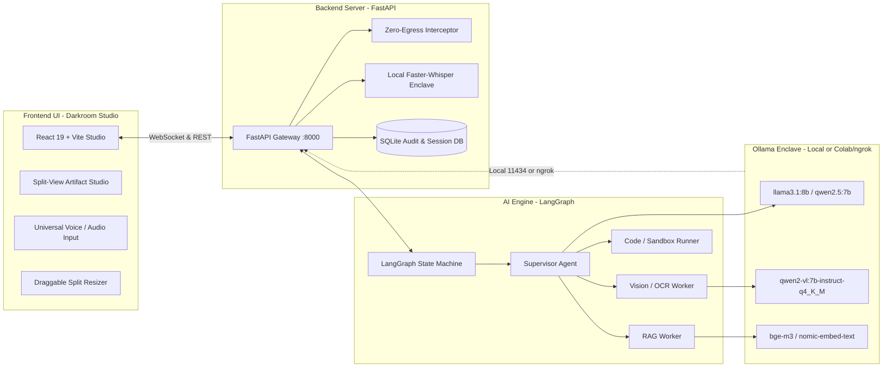

# 🛡️ SIH26117 — Sovereign On-Premise AI Workbench

> **An air-gapped, sovereign, multi-agent AI engineering workbench designed for mission-critical industrial operations, technical document RAG, isolated sandbox execution, and artifact generation.**

---

## 🏗️ Architecture Overview

The workbench operates as a 3-tier sovereign ecosystem with **zero external network egress**:



---

## ✨ Key Features & Capabilities

- **Editorial Darkroom Studio UI**: Monospaced typography, warm amber glow accents, analog film-grain texture, 60fps Framer Motion spring physics.
- **Draggable Fluid Split View**: Drag-and-resize between Chat and Artifact panels with snapping and double-click reset.
- **Compact 56px Icon-Rail (`⌘B` / `Ctrl+B`)**: Reclaims 224px screen real-estate with 1-click navigation icons.
- **Dual-Pane Code & Terminal Enclave**: Side-by-side syntax-highlighted code editor and live subprocess execution output with status metrics.
- **2-Column Side-by-Side Diff Inspector**: Visual historical baseline vs. active head comparison.
- **Universal Voice / Audio Input**: Real-time microphone capture with live frequency equalizer bars and local air-gapped Whisper transcription.
- **Sovereign Air-Gap & Zero-Egress**: Cryptographic SHA-256 audit logging and outbound request interception.

---

## ⚡ Prerequisites

Ensure the following tools are installed on your host machine:

| Tool | Minimum Version | Purpose |
|---|---|---|
| **Python** | `v3.11+` | Backend FastAPI server & LangGraph AI engine |
| **uv** | `v0.1.0+` *(Recommended)* | High-speed Python package and venv manager |
| **Node.js** | `v18.0.0+` (`npm`) | Frontend React + Vite Darkroom Studio |
| **Ollama** | `v0.3.0+` | Local inference engine for open-weights models |

---

## 📦 Model Setup & Download

You can run the inference models in either of two modes: **Local On-Premise GPU/CPU** or **Remote Google Colab GPU (via ngrok)**.

---

### Option A: Local On-Premise Ollama (Recommended for GPU Workstations)

1. **Install Ollama**:
   - **Linux**:
     ```bash
     curl -fsSL https://ollama.com/install.sh | sh
     ```
   - **macOS / Windows**: Download from [ollama.com/download](https://ollama.com/download).

2. **Start the Ollama daemon**:
   ```bash
   ollama serve
   ```

3. **Pull required models in a new terminal**:
   ```bash
   # 1. Core Reasoning & Supervisor Model (~4.7 GB)
   ollama pull llama3.1:8b

   # 2. Multimodal Vision & Diagram OCR Model (~4.5 GB)
   ollama pull qwen2-vl:7b-instruct-q4_K_M

   # 3. Dense Semantic Embeddings for RAG (~1.2 GB)
   ollama pull bge-m3
   ```

   *(Alternative lighter models for low VRAM systems: `qwen2.5:7b-instruct-q4_K_M` and `nomic-embed-text:latest`)*

4. **Verify loaded models**:
   ```bash
   ollama list
   ```

---

### Option B: Remote Google Colab GPU + ngrok Tunneling

If your local machine does not have a dedicated GPU, you can run Ollama on a free Google Colab **T4 GPU** or **A100 GPU** and tunnel the inference endpoint back to your workbench via ngrok.

#### 1. Open Google Colab & Select GPU:
- Go to [colab.research.google.com](https://colab.research.google.com).
- Click **Runtime** > **Change runtime type** > Select **T4 GPU** (or **A100 GPU**) > **Save**.

#### 2. Run this setup script in a Colab code cell:

```python
# ==============================================================================
# 🚀 GOOGLE COLAB OLLAMA + NGROK INFERENCE HOST
# ==============================================================================

# 1. Install Ollama and pyngrok
!curl -fsSL https://ollama.com/install.sh | sh
!pip install pyngrok

import os
import subprocess
import time
from pyngrok import ngrok

# 2. Enter your free ngrok Authtoken (from https://dashboard.ngrok.com/get-started/your-authtoken)
NGROK_AUTH_TOKEN = "YOUR_NGROK_AUTH_TOKEN_HERE"  # <-- Replace with your token
ngrok.set_auth_token(NGROK_AUTH_TOKEN)

# 3. Start Ollama daemon in background
print("Starting Ollama background server...")
subprocess.Popen(["ollama", "serve"])
time.sleep(4)

# 4. Pull required models onto the Colab GPU
print("Pulling models into GPU VRAM...")
!ollama pull llama3.1:8b
!ollama pull qwen2-vl:7b-instruct-q4_K_M
!ollama pull bge-m3

# 5. Open public ngrok tunnel to Ollama port 11434
public_tunnel = ngrok.connect(11434, "http")
print("\n" + "="*70)
print(f"✅ OLLAMA INFERENCE TUNNEL ACTIVE!")
print(f"👉 Copy this URL into your workbench .env file:")
print(f"OLLAMA_BASE_URL={public_tunnel.public_url}")
print("="*70)
```

#### 3. Copy the ngrok URL into your `.env`:
Set `OLLAMA_BASE_URL=https://your-unique-subdomain.ngrok-free.app` in your `.env` file.

---

## ⚙️ Environment Configuration (`.env`)

Create your `.env` file in the project root by copying `.env.example`:

```bash
cp .env.example .env
```

### Complete `.env` Reference:

```ini
# ==============================================================================
# 1. INFERENCE ENDPOINT
# ==============================================================================
# Local Ollama:
OLLAMA_BASE_URL=http://localhost:11434

# OR Remote Colab ngrok tunnel:
# OLLAMA_BASE_URL=https://your-ngrok-subdomain.ngrok-free.app

# ==============================================================================
# 2. MODEL OVERRIDES
# ==============================================================================
REASONING_MODEL=llama3.1:8b
VISION_MODEL=qwen2-vl:7b-instruct-q4_K_M
EMBEDDING_MODEL=bge-m3
EMBEDDING_DIMENSIONS=1024

# ==============================================================================
# 3. FASTAPI GATEWAY SETTINGS
# ==============================================================================
HOST=0.0.0.0
PORT=8000
DEBUG=True
API_V1_PREFIX=/api/v1
PROJECT_NAME="SIH PS26117 Sovereign Agentic Workbench Gateway"

# ==============================================================================
# 4. AIR-GAP & SANDBOX CONTROLS
# ==============================================================================
ENFORCE_ZERO_EGRESS=True
SANDBOX_TIMEOUT_SECONDS=10
SANDBOX_MEMORY_LIMIT_MB=512
```

---

## 🚀 Step-by-Step Execution Guide

### Step 1: Start the Backend Gateway

1. Open a terminal and navigate to the project directory:
   ```bash
   cd SIH_26_WORKBENCH_AI
   ```

2. Start the FastAPI server using `uv` (or `python -m uvicorn`):
   ```bash
   uv run uvicorn backend.app.main:app --host 0.0.0.0 --port 8000 --reload
   ```

   The backend will initialize the SQLite enclave database and expose:
   - **REST Gateway**: `http://localhost:8000`
   - **Interactive Swagger API Docs**: `http://localhost:8000/docs`
   - **Real-time Agent WebSocket**: `ws://localhost:8000/api/v1/agents/ws/{session_id}`
   - **Audio Whisper Transcribe Endpoint**: `http://localhost:8000/api/v1/audio/transcribe`

---

### Step 2: Start the Frontend UI

1. Open a second terminal and navigate to the `frontend/` directory:
   ```bash
   cd SIH_26_WORKBENCH_AI/frontend
   ```

2. Install dependencies:
   ```bash
   npm install
   ```

3. Start the Vite development server:
   ```bash
   npm run dev
   ```

4. Open your browser:
   ```
   http://localhost:5173
   ```

---

## 🧪 Testing & Verification Suite

### 1. Verify Backend Health & Model Connectivity
```bash
curl -s http://localhost:8000/api/v1/system/health | jq
```

### 2. Run Automated API & Sandbox Tests
```bash
uv run --with pytest --with pytest-asyncio --with httpx pytest backend/tests/
```

### 3. Check Python Syntax Across All Modules
```bash
uv run python -m py_compile backend/app/main.py backend/app/services/agent_engine.py backend/app/api/v1/endpoints/audio.py
```

### 4. Build Frontend Production Bundle
```bash
npm --prefix frontend run build
```

---

## 📁 Repository Directory Layout

```
SIH_26_WORKBENCH_AI/
├── ai_engine/                   # LangGraph multi-agent orchestration
│   ├── agents/                  # Supervisor, RAG, Code, Vision agent nodes
│   ├── prompts/                 # Industrial SOP prompts & compliance grounding
│   ├── tools/                   # Sandbox runner, doc generator, vector search
│   ├── graph.py                 # Compiled LangGraph workflow state machine
│   └── state.py                 # TypedDict agent state definitions
│
├── backend/                     # FastAPI Sovereign Gateway
│   ├── app/
│   │   ├── api/v1/endpoints/    # REST routes (audio, sandbox, documents, ws)
│   │   ├── core/                # Zero-egress interceptor & security audit
│   │   ├── models/              # SQLAlchemy & Pydantic schemas
│   │   ├── services/            # Ollama client, Whisper transcription, sandbox
│   │   └── main.py              # Application lifecycle entry point
│   ├── storage/                 # Local uploads, artifacts, and SQLite database
│   └── tests/                   # Pytest automated test suites
│
├── frontend/                    # React 19 + Vite Darkroom Studio
│   ├── src/
│   │   ├── components/
│   │   │   ├── artifact/        # Split-View Artifact Studio & Dual-Pane Terminal
│   │   │   ├── chat/            # InputBar with universal voice input, MessageBlock
│   │   │   └── layout/          # 56px Icon-Rail Sidebar, CommandPalette (⌘K)
│   │   ├── routes/              # ChatPage (Draggable Split), Chats, Projects, Library
│   │   └── lib/                 # API client, WebSocket manager, WorkbenchContext
│   └── vite.config.ts           # Proxy configuration for backend API & WS
│
├── .env.example                 # Environment configuration template
└── README.md                    # System documentation & setup manual
```

---

## 🔒 Security & Air-Gap Compliance

- **Zero-Egress Interception**: The backend middleware blocks any outgoing network requests outside localhost / local enclave IP ranges.
- **Cryptographic Audit Log**: Every user query, tool invocation, and generated output is cryptographically hashed (`SHA-256`) and stored in SQLite for industrial compliance.
- **Subprocess Isolation**: Code execution runs in an isolated sandbox with strict CPU, memory, and timeout constraints.
- **Air-Gapped Whisper**: Audio transcription runs entirely on-premise without external cloud APIs.

---

## 📖 Deep Dive Documentation

- **[System Status & Integration Roadmap](file:///home/maaz/Personal/SIH_26_WORKBENCH_AI/backend/Docs/SYSTEM_STATUS_AND_INTEGRATION_ROADMAP.md)** (`backend/Docs/SYSTEM_STATUS_AND_INTEGRATION_ROADMAP.md`)
- **[Frontend Darkroom Design System](file:///home/maaz/Personal/SIH_26_WORKBENCH_AI/frontend/DESIGN.md)** (`frontend/DESIGN.md`)
- **[SIH Problem Statement Specification](file:///home/maaz/Personal/SIH_26_WORKBENCH_AI/docs/SIH26117.md)** (`docs/SIH26117.md`)
