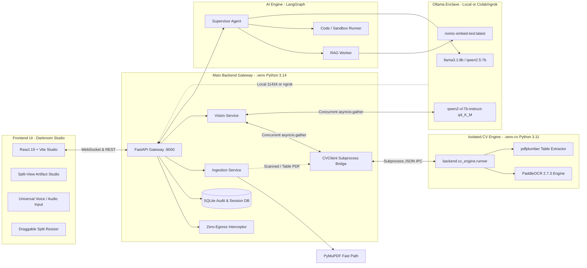

# 🛡️ SIH26117 — Sovereign On-Premise AI Workbench

> **A sovereign, multi-agent AI engineering workbench designed for mission-critical industrial operations, technical document RAG, isolated sandbox execution, 2D spatial CV document processing, and artifact generation with configurable zero-egress controls.**

---

## 🏗️ Architecture Overview

The workbench operates as a sovereign ecosystem with **configurable zero-egress controls**, utilizing a dual-environment Python architecture for main backend gateway operations and computer vision isolation:



---

## ✨ Key Features & Capabilities

- **Editorial Darkroom Studio UI**: Monospaced typography, warm amber glow accents, analog film-grain texture, 60fps Framer Motion spring physics.
- **Draggable Fluid Split View**: Drag-and-resize between Chat and Artifact panels with snapping and double-click reset.
- **Compact 56px Icon-Rail (`⌘B` / `Ctrl+B`)**: Reclaims 224px screen real-estate with 1-click navigation icons.
- **Dual-Pane Code & Terminal Enclave**: Side-by-side syntax-highlighted code editor and live subprocess execution output with status metrics.
- **Isolated Computer Vision Engine**: 2D spatial text bounding boxes `[ymin, xmin, ymax, xmax]` via PaddleOCR and Markdown table extraction via `pdfplumber`.
- **Hybrid VLM + OCR Spatial Fusion**: Concurrent Qwen2-VL vision analysis + PaddleOCR spatial grounding with IoB/IoU tag enrichment.
- **Universal Voice / Audio Input**: Real-time microphone capture with live frequency equalizer bars and local air-gapped Whisper transcription.
- **Configurable Zero-Egress Controls**: Cryptographic SHA-256 audit logging and outbound request interception.

---

## ⚡ Prerequisites

Ensure the following runtimes and tools are installed on your host machine:

| Tool | Environment / Version | Purpose |
|---|---|---|
| **Python 3.14** | Main `.venv` | FastAPI Gateway, Ingestion Service, Vision Service, SQLite & ChromaDB |
| **Python 3.11** | Isolated `.venv-cv` | PaddleOCR, `paddlepaddle`, `pdfplumber`, `opencv-python-headless` |
| **Node.js** | `v18.0.0+` (`npm`) | Frontend React 19 + Vite Darkroom Studio |
| **Ollama** | `v0.3.0+` | Local inference engine for LLM (`llama3.1:8b`), VLM (`qwen2-vl`), and embeddings |

---

## 👁️ Computer Vision Pipeline & Dual-Environment Setup

### Why the CV Environment is Isolated
Computer Vision dependencies (`paddlepaddle>=2.6.0,<3.0.0`, `paddleocr==2.7.3`, `numpy<2.0.0`) require Python 3.11 C-extension binary compatibility and specific library versions. To prevent C-extension DLL conflicts and dependency pollution in the main Python 3.14 backend, the CV engine runs strictly inside its own `.venv-cv` virtual environment.

### 1. CV Environment Installation
Create `.venv-cv` and install the dedicated CV requirements:

```bash
# 1. Create Python 3.11 virtual environment in project root
python3.11 -m venv .venv-cv

# 2. Activate environment
# On Windows:
.venv-cv\Scripts\activate
# On Linux/macOS:
source .venv-cv/bin/activate

# 3. Install CV dependencies
pip install -r backend/cv_engine/requirements.txt
```

### 2. CV Dependencies (`backend/cv_engine/requirements.txt`)
The CV environment contains pinned dependencies for OCR and table extraction:
- `paddlepaddle>=2.6.0,<3.0.0`
- `paddleocr==2.7.3`
- `opencv-python-headless>=4.8.0`
- `pdfplumber>=0.10.0`
- `pillow>=10.0.0`
- `numpy>=1.24.0,<2.0.0`

### 3. Local Model Weights & Directory Setup
PaddleOCR model directory can be specified via the `--model-dir` flag when running `backend.cv_engine.runner`:
- **Detection Model**: `ch_PP-OCRv4_det`
- **Recognition Model**: `ch_PP-OCRv4_rec`
- **Classification Model**: `ch_ppocr_mobile_v2.0_cls`

*Note: For strict air-gapped deployments, pre-download and place model weights in the directory specified by `--model-dir`. First-run automatic PaddleOCR model weight downloading is provided as a setup/development convenience when network access is available.*

### 4. On-Demand Worker Architecture
The CV worker is launched **on-demand** by `CVClient` for specific requests and does **not** require a separate persistent daemon or long-running background service. The main Python 3.14 backend invokes the worker as a subprocess:
```powershell
.venv-cv\Scripts\python.exe -m backend.cv_engine.runner --input <file_path> --output <temp_json_path>
```
`CVClient` automatically manages process execution, sets `cwd` to the repository root, parses the output JSON contract, and deletes transient JSON files in a `finally` block upon completion.
 block upon completion.

---

## 🔄 Document Ingestion & Vision Pipeline Routing

### 1. Document Ingestion Pipeline (`ingestion_service.py`)
- **Normal Text PDFs**: PyMuPDF (`fitz`) fast-path extracts page text directly without invoking `.venv-cv`.
- **Scanned PDFs & Images**: Evaluated using a deterministic trigger condition:
  $$\text{Trigger CVClient} \iff (\text{clean\_ext} \in \text{images}) \lor (\text{total\_chars} < 50) \lor (\text{avg\_chars\_per\_page} < 20) \lor (\text{has\_tables} = \text{True})$$
- **Chunking & Indexing**: PaddleOCR text blocks and `pdfplumber` Markdown tables enter the standard `chunk_text()` pipeline. Chunks are embedded via `ollama_client` and persisted into SQLite (`DocumentChunk`) and ChromaDB vector store.
- **Fallback**: If CV processing fails or times out, image ingestion returns an empty text fallback (`[], 1`), and PDF ingestion falls back to PyMuPDF native text chunks.

### 2. Vision Service Pipeline (`vision_service.py`)
- **Concurrent Execution**: `POST /api/v1/vision/analyze` executes Qwen2-VL VLM inference and `CVClient` PaddleOCR concurrently via `asyncio.gather(..., return_exceptions=True)`.
- **Deterministic Spatial Fusion**:
  - Calculates Intersection-over-BBox ($\text{IoB}_{\text{ocr}}$) and Intersection-over-Union ($\text{IoU}$).
  - For each OCR Equipment Tag, selects **exactly one** best VLM candidate matching $\text{IoB} \ge 0.50$ or $\text{IoU} \ge 0.20$.
  - Enriches the VLM element's `tag_code` with the OCR tag text without altering the VLM bounding box.
  - Retains both VLM elements and OCR elements in the final response.
- **Fallback Harness**:
  - If `CVClient` fails: returns Qwen2-VL detections.
  - If Qwen2-VL is offline/fails: returns `CVClient` PaddleOCR detections.
  - If both fail: returns deterministic domain sample P&ID elements (`Control Valve CV-401`, `Pressure Indicator PI-105`, `Centrifugal Feed Pump P-201A`).

---

## 📦 Model Setup & Download

You can run inference models in **Local On-Premise GPU/CPU** or **Remote Google Colab GPU (via ngrok)** mode.

---

### Option A: Local On-Premise Ollama (Recommended)

1. **Install Ollama**:
   - **Linux**: `curl -fsSL https://ollama.com/install.sh | sh`
   - **Windows / macOS**: Download from [ollama.com/download](https://ollama.com/download).

2. **Start the Ollama daemon**:
   ```bash
   ollama serve
   ```

3. **Pull required models**:
   ```bash
   # 1. Reasoning & Supervisor Model
   ollama pull llama3.1:8b

   # 2. Multimodal Vision Model
   ollama pull qwen2-vl:7b-instruct-q4_K_M

   # 3. Dense Semantic Embeddings
   ollama pull nomic-embed-text:latest
   ```

---

### Option B: Remote Google Colab GPU + ngrok Tunneling

For systems without dedicated local GPUs, run Ollama on Google Colab (T4 / A100 GPU) and tunnel to port 11434 via ngrok. Set `OLLAMA_BASE_URL=https://your-ngrok-subdomain.ngrok-free.app` in your `.env`.

---

## ⚙️ Environment Configuration (`.env`)

Copy `.env.example` to `.env`:

```ini
# Inference Endpoint
OLLAMA_BASE_URL=http://localhost:11434

# Model Configurations
REASONING_MODEL=llama3.1:8b
VISION_MODEL=qwen2-vl:7b-instruct-q4_K_M
EMBEDDING_MODEL=nomic-embed-text:latest
EMBEDDING_DIMENSIONS=768

# FastAPI Gateway Settings
HOST=0.0.0.0
PORT=8000
DEBUG=True
API_V1_PREFIX=/api/v1
PROJECT_NAME="SIH PS26117 Sovereign Agentic Workbench Gateway"

# Air-Gap & Security
ENFORCE_ZERO_EGRESS=True
SANDBOX_TIMEOUT_SECONDS=10
SANDBOX_MEMORY_LIMIT_MB=512
```

---

## ⚡ Quick Start (Single Command)

Launch both **Backend Gateway** and **Frontend UI** concurrently:

```bash
python start_all.py
```
*(Or double-click `start_all.bat` / run `.\start_all.ps1` on Windows)*

---

## 🚀 Step-by-Step Execution Guide

### Step 1: Main Backend Setup (.venv)

1. Navigate to project root:
   ```bash
   cd SIH_26_WORKBENCH_AI
   ```

2. Create main Python 3.14 environment and install dependencies:
   ```bash
   python -m venv .venv
   # Windows: .venv\Scripts\activate | Linux: source .venv/bin/activate
   pip install -r requirements.txt
   ```

3. Start FastAPI server:
   ```bash
   uvicorn backend.app.main:app --host 0.0.0.0 --port 8000 --reload
   ```

   Gateway Endpoints:
   - **REST Gateway**: `http://localhost:8000`
   - **Interactive Swagger API Docs**: `http://localhost:8000/docs`
   - **Real-time Agent WebSocket**: `ws://localhost:8000/api/v1/agents/ws/{session_id}`
   - **Schematic Vision Analysis**: `http://localhost:8000/api/v1/vision/analyze`

---

### Step 2: Frontend Setup

1. Navigate to `frontend/`:
   ```bash
   cd frontend
   npm install
   npm run dev
   ```

2. Open browser at `http://localhost:5173`.

---

## 🧪 Testing & Verification Suite

### 1. Test Isolated CV Runner CLI
```powershell
.venv-cv\Scripts\python.exe -m backend.cv_engine.runner --help
```

### 2. Verify Backend Health & Model Connectivity
```bash
curl -s http://localhost:8000/api/v1/system/health
```

### 3. Run Automated Pytest Suite
```bash
pytest backend/tests/
```

### 4. Build Frontend Production Bundle
```bash
npm --prefix frontend run build
```

---

## 📁 Repository Directory Layout

```
SIH_26_WORKBENCH_AI/
├── ai_engine/                   # LangGraph multi-agent orchestration
│   ├── agents/                  # Supervisor, RAG, Code, Vision agent nodes
│   ├── tools/                   # Sandbox runner, doc generator, vector search
│   └── graph.py                 # LangGraph state machine definition
│
├── backend/                     # FastAPI Sovereign Gateway
│   ├── app/
│   │   ├── api/v1/endpoints/    # REST routes (audio, sandbox, documents, vision, ws)
│   │   ├── core/                # Zero-egress interceptor & security audit
│   │   ├── models/              # SQLAlchemy & Pydantic schemas (CVRunnerResponse, DetectedElement)
│   │   ├── services/            # CVClient bridge, ingestion, vision, ollama, vector store
│   │   └── main.py              # Application lifecycle entry point
│   ├── cv_engine/               # Isolated CV Engine (.venv-cv, Python 3.11)
│   │   ├── ocr_processor.py     # PaddleOCR 2D spatial bounding box wrapper
│   │   ├── table_extractor.py   # pdfplumber table extraction
│   │   ├── runner.py            # CLI entrypoint & JSON IPC output generator
│   │   └── requirements.txt     # Isolated CV environment dependencies
│   ├── storage/                 # Uploads, artifacts, temp dir, SQLite DB
│   └── tests/                   # Pytest automated test suites
│
├── frontend/                    # React 19 + Vite Darkroom Studio
│   ├── src/
│   │   ├── components/          # Split-View Artifact Studio & Dual-Pane Terminal
│   │   ├── routes/              # ChatPage, Chats, Projects, Library
│   │   └── lib/                 # API client & WebSocket manager
│   └── vite.config.ts           # Proxy configuration for backend API & WS
│
├── start_all.py                 # Unified launcher for frontend & backend
└── README.md                    # System documentation & setup manual
```

---

## 🔒 Security & Air-Gap Compliance

- **On-Premise Local Processing**: All document parsing (PyMuPDF), OCR (PaddleOCR), table extraction (`pdfplumber`), embeddings (ChromaDB), and speech transcription (Whisper) execute strictly on-premise.
- **Zero-Egress Interception**: FastAPI middleware intercepts network calls, enforcing zero outbound egress to external cloud APIs when `ENFORCE_ZERO_EGRESS=True`.
- **Cryptographic Audit Log**: Every user prompt, tool execution, and document chunk citation is SHA-256 hashed and logged in SQLite.
- **Isolated Process Execution**: Code execution runs in isolated sandbox processes with strict CPU, memory, and timeout bounds.
