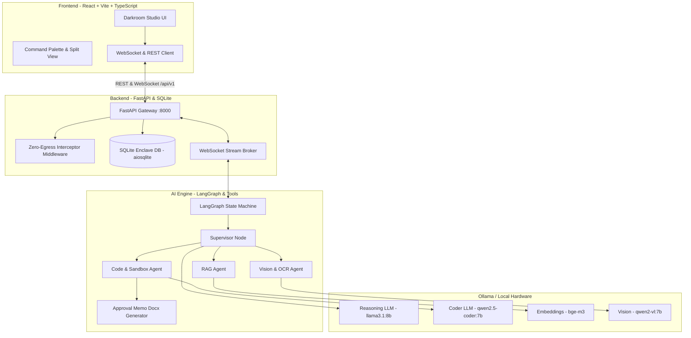

# Sovereign On-Premise AI Workbench — System Status & Integration Roadmap

**Target Spec**: SIH26117 — Sovereign, Air-Gapped, Multi-Agent Industrial Engineering Workbench  
**Architecture Status**: 3-Tier Integration (Frontend ↔ Backend ↔ AI Engine)  
**Security Posture**: Strict Zero-Egress / On-Premise Enclave Isolation  

---

## 1. System Architecture Overview

The Sovereign AI Workbench consists of three interconnected layers operating entirely on-premise without external network egress:



---

## 2. Currently Implemented Components

### A. Frontend Layer (`frontend/`)
- [x] **Darkroom Editorial Design System**: Complete design token implementation (`frontend/src/index.css`, `tailwind.config.ts`, `DESIGN.md`) with custom amber accents (`#D97A3F`), analog film-grain screen blend overlay, and typography hierarchy (Fraunces + General Sans + JetBrains Mono).
- [x] **Unified Chat & Split View (`ChatPage.tsx`)**:
  - **Screen 1 (Zero State)**: Asymmetric 4-card suggestion grid with stagger-collapse animations.
  - **Screen 2 (Active Stream)**: Chat feed with expandable `ThinkingIndicator`, Markdown rendering, and code block formatting.
  - **Screen 3 (Split View)**: 46% Chat / 54% Artifact panel with spring animations.
- [x] **Artifact Studio (`ArtifactPanel.tsx`)**: Version rail, live preview, diff viewer, and export options.
- [x] **Route Coverage**:
  - `/` & `/chat/:id`: Chat and multi-file artifact workspace.
  - `/chats`: Searchable session history archive.
  - `/projects`: Active engineering initiatives and project index.
  - `/library`: Reusable component, schema, and API catalog.
  - `/settings`: Inference calibration, temperature, reasoning effort, and darkroom toggles.
- [x] **Backend Client & Streaming (`lib/api.ts` & `WorkbenchContext.tsx`)**:
  - WebSocket stream connection to `/api/v1/agents/ws/{session_id}`.
  - Dynamic frame handler for `thought`, `tool_call`, `tool_result`, and `final_answer`.
  - Resilient automatic fallback to simulated mock inference when backend server is offline.

### B. Backend Gateway Layer (`backend/app/`)
- [x] **Zero-Egress Security Interceptor (`core/zero_egress.py`)**: Intercepts and blocks non-local outbound socket requests.
- [x] **Async SQLite Persistence (`database.py` & `models/sql_models.py`)**:
  - `workspaces`: Multi-workspace isolation.
  - `documents` & `document_chunks`: Document metadata and chunk index.
  - `agent_sessions`: Multi-turn session states.
  - `audit_logs`: Cryptographic audit traces (SHA-256 prompt hashes, tool traces, egress validation).
- [x] **REST API Routers (`api/v1/endpoints/`)**:
  - `/workspaces`: Create, list, retrieve workspaces.
  - `/workspaces/{id}/documents/upload`: File upload, format detection, and automated chunking.
  - `/sandbox/execute`: Isolated subprocess execution with memory/timeout limits.
  - `/vision/analyze`: Optical layout parsing and component entity detection.
  - `/system/health`: Enclave telemetry, GPU memory, loaded models, air-gap status.
  - `/audit/traces`: Compliance verification and audit trail export.
  - `/artifacts/download/{filename}`: Secure artifact retrieval.
- [x] **Real-Time WebSocket Gateway (`agent_ws.py`)**: Sub-millisecond event streaming with connection lifecycle management.

### C. AI Engine Layer (`ai_engine/`)
- [x] **LangGraph Orchestration State Machine (`graph.py` & `state.py`)**: Multi-agent workflow executing step-by-step state transitions.
- [x] **Supervisor Coordinator (`agents/supervisor.py`)**: Analyzes intent and constructs execution plans.
- [x] **RAG Compliance Worker (`agents/rag_agent.py`)**: Queries vector store, retrieves relevant passages, and builds citation metadata.
- [x] **Code & Sandbox Worker (`agents/code_agent.py`)**: Generates mathematical models and executes isolated scripts in the sandbox.
- [x] **Vision Worker (`agents/vision_agent.py`)**: Detects equipment tags, rating tables, and bounding boxes.
- [x] **Approval Memo Generator (`tools/doc_generator.py`)**: Generates `.docx` regulatory approval memoranda.
- [x] **Local Ollama Integration (`services/ollama_client.py` & `ai_engine/config.py`)**: Connects to local Ollama instance on `http://localhost:11434`.

---

## 3. Communication & Data Protocol Contracts

### WebSocket Frame Specification (`/api/v1/agents/ws/{session_id}`)

#### 1. Client Run Request
```json
{
  "workspace_id": "ws_12345678",
  "prompt": "Calculate the effective MAWP at 480°C and generate an approval memo.",
  "active_document_ids": ["doc_boiler_spec_v2"],
  "allowed_tools": ["rag_search", "sandbox_execute"],
  "temperature": 0.2
}
```

#### 2. Agent Step Frame (Thought)
```json
{
  "event": "thought",
  "step": 1,
  "content": "Analyzing workspace context for 'Calculate the effective MAWP...' and determining optimal tool sequence."
}
```

#### 3. Agent Tool Call Frame
```json
{
  "event": "tool_call",
  "step": 2,
  "tool_name": "rag_search",
  "tool_call_id": "call_rag_9918",
  "parameters": {
    "query": "MAWP thermal degradation formula",
    "document_ids": ["doc_boiler_spec_v2"],
    "top_k": 3
  }
}
```

#### 4. Final Answer Frame with Citations & Telemetry
```json
{
  "event": "final_answer",
  "step": 5,
  "content": "The Maximum Allowable Working Pressure at 480°C is 128.8 bar...",
  "citations": [
    {
      "document_id": "doc_boiler_spec_v2",
      "chunk_id": "chk_101",
      "page_number": 4,
      "snippet": "Section 4.1: MAWP is rated at 160 bar up to 350°C..."
    }
  ],
  "metrics": {
    "total_tokens": 1042,
    "execution_time_ms": 485,
    "air_gap_intact": true
  }
}
```

---

## 4. Pending Implementation & Future Roadmap

| Priority | Feature Area | Description | Target Component |
|---|---|---|---|
| **High** | **Live PDF / P&ID Bounding Box Viewer** | Implement visual overlay rendering bounding boxes (`[ymin, xmin, ymax, xmax]`) directly on top of uploaded PDFs in Split View. | `frontend/src/components/artifact/` & `ai_engine/agents/vision_agent.py` |
| **High** | **Native Surya / Qwen2-VL Vision Pipeline** | Integrate local Surya OCR and direct Qwen2-VL tensor inference for offline blueprint transcription. | `backend/app/services/vision_service.py` |
| **Medium** | **Persistent Local Vector Database** | Replace in-memory vector index with persistent local Milvus Lite or Chroma vector store with HNSW indexing. | `backend/app/services/vector_store.py` |
| **Medium** | **Hardened Linux cgroup / Docker Sandbox** | Transition subprocess sandbox to containerized micro-VM (gVisor or Firecracker / Docker cgroup) for kernel-level protection. | `backend/app/services/sandbox_service.py` |
| **Low** | **Interactive Diagram Canvas** | Embed tldraw or React Flow canvas inside the Artifact Panel for live editing of generated P&ID schemas. | `frontend/src/components/artifact/` |
| **Low** | **Enterprise RBAC & Audit Export** | Add cryptographically signed PDF audit certificate export for regulatory review boards. | `backend/app/api/v1/endpoints/audit.py` |

---

## 5. How to Run & Verify the Full Stack

### Step 1: Start Ollama (Local AI Inference)
Ensure Ollama is running with the required sovereign models:
```bash
ollama run llama3.1:8b
ollama run qwen2.5-coder:7b
ollama run bge-m3
```

### Step 2: Start FastAPI Backend Gateway
In a dedicated terminal:
```bash
uv run uvicorn backend.app.main:app --host 0.0.0.0 --port 8000 --reload
```
API Documentation will be available at: `http://localhost:8000/docs`

### Step 3: Start Frontend Darkroom Studio
In another terminal:
```bash
cd frontend
npm run dev
```
Open your browser at: `http://localhost:5173`

### Step 4: Run Automated Verification Tests
```bash
# Backend endpoint tests
uv run --with pytest --with pytest-asyncio --with httpx pytest backend/tests/

# Frontend production build verification
npm --prefix frontend run build
```
