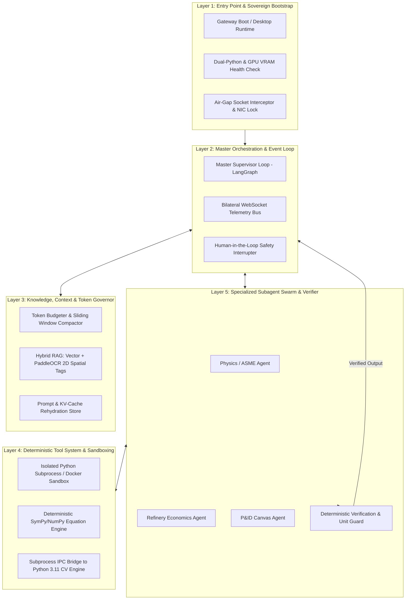
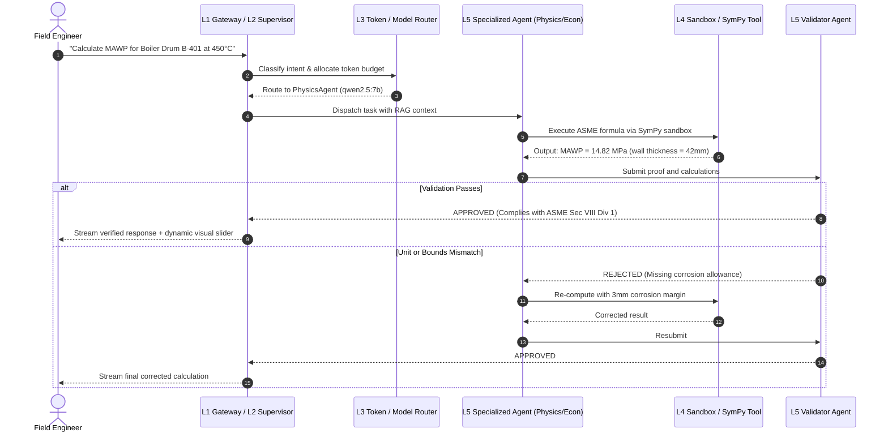

# 🏛️ Sovereign AI Workbench — Master System Architecture Document (SAD)
**Project Code:** SIH26117 | **Target Facility:** High-Hazard Industrial Plants (e.g., MRPL)  
**Security Level:** Sovereign Air-Gapped (Zero-Egress) | **Compliance:** ASME Section VIII, OISD-156, OSHA 1910.119  
**Architectural Paradigm:** 5-Tier Decoupled Agentic Engine (Adapted from Advanced Agentic Frameworks like Claude Code)

---

## 1. Architectural Philosophy: From Chatbot to Sovereign Agentic Enclave

Most AI hackathon projects fail because they treat an LLM as a direct chatbot (`User Prompt -> LLM API -> Raw Markdown Response`). In high-consequence engineering (refineries, defense, nuclear facilities), this approach causes critical failures:
1. **Unbounded Context & Hallucination**: Industrial formulas cannot tolerate probabilistic guesses.
2. **Monolithic Spaghetti**: UI, LLM routing, file ingestion, and execution mixed into one fragile process.
3. **No Safety Boundaries**: No deterministic validation, no air-gap enforcement, and zero tool execution governance.

### Adapting State-of-the-Art Agent Architectures (Claude Code Paradigm)
Modern, industrial-grade agent systems (such as the architecture pioneered by **Claude Code** and elite autonomous engineering systems) solve this by strictly decoupling responsibilities across **five independent layers**:



---

## 2. The 5 Decoupled Layers in Detail

### Layer 1: Entry Point, Bootstrap & Sovereign Enclave Validator
*Purpose: Initialize runtimes, verify air-gap compliance, and prevent execution if constraints fail.*

1. **Dual-Python Runtime Verification**:
   - Gateway verifies `.venv` (Python 3.14 for async FastAPI & LangGraph) and `.venv-cv` (Python 3.11 for PaddleOCR / PaddlePaddle binary compatibility).
   - If `.venv-cv` binaries are missing, the system gracefully degrades to PyMuPDF fast-path without crashing.
2. **GPU VRAM & Local Model Pre-flight**:
   - Queries Ollama local server (`127.0.0.1:11434`).
   - Confirms presence of target models:
     - Tier 1 Fast SLM: `qwen2.5:1.5b` (Intent router & JSON schema enforcement)
     - Tier 2 Reasoning LLM: `qwen2.5:7b-instruct-q4_K_M` or `llama3.1:8b`
     - Tier 3 Spatial VLM: `qwen2-vl:7b-instruct-q4_K_M`
     - Embeddings: `nomic-embed-text:latest`
3. **Zero-Egress Network Interception**:
   - Binds gateway exclusively to localhost/private subnet interfaces.
   - Installs outbound socket hooks that immediately block and log any non-local TCP/UDP socket attempt with a cryptographic SHA-256 security audit trail.

---

### Layer 2: Master Orchestration & Event Loop
*Purpose: Coordinate state transitions, manage streaming deltas, and provide pause/resume interrupts.*

1. **State Machine Loop (Supervisor-Worker Pattern)**:
   - Inspired by Claude Code's master execution loop: prompt ingestion $\rightarrow$ intent classification $\rightarrow$ plan construction $\rightarrow$ tool execution $\rightarrow$ self-correction $\rightarrow$ response compilation.
   - State is modeled as an immutable, append-only state graph using LangGraph.
2. **Bilateral WebSocket Event Bus**:
   - Full duplex communication between client and server via `ws://localhost:8000/api/v1/ws/agent`.
   - Emits fine-grained event types:
     - `token_delta`: Real-time streaming tokens.
     - `thought_trace`: Inner monologue of the supervisor explaining *why* it selected a tool.
     - `tool_call_started` / `tool_call_finished`: Visual indicators with latency metrics.
     - `telemetry_tick`: Live TPS, VRAM, and GPU temperature.
3. **Human-in-the-Loop (HITL) Safety Barrier**:
   - For high-consequence operations (e.g., executing arbitrary Python sandbox code or altering refinery setpoints), the loop yields an `INTERRUPT` event and awaits an explicit user approval token before resuming execution.

---

### Layer 3: Knowledge, Context & Token Governor
*Purpose: Prevent context window overflow, optimize inference speed, and handle multimodal documents.*

```
Context Budget (32,768 Tokens Total)
┌──────────────────┬────────────────────────┬─────────────────────┬──────────────────┐
│ System Prompts   │ Retrieved RAG Chunks   │ Working History     │ Output Reserve   │
│ (1,024 tokens)   │ (8,192 tokens max)     │ (19,456 tokens max) │ (4,096 tokens)   │
└──────────────────┴────────────────────────┴─────────────────────┴──────────────────┘
```

1. **Dynamic Context Budgeter**:
   - Tracks precise token counts per turn using `tiktoken` / model tokenizers.
   - If cumulative conversation context exceeds 75% of context window, the Governor triggers **Extractive Auto-Compaction**:
     - Summarizes earlier conversational turns into compact bullet points.
     - Retains technical constants (temperatures, equipment IDs, ASME allowable stresses).
2. **Hybrid Spatial RAG Engine**:
   - Native PyMuPDF parser extracts high-speed raw text.
   - For complex blueprints or scanned documents, the CV Bridge extracts bounding boxes `[ymin, xmin, ymax, xmax]`.
   - Vector storage uses ChromaDB (768-dimensional `nomic-embed-text` vectors) with metadata filtering on `workspace_id`, `equipment_tag`, and `page_number`.

---

### Layer 4: Deterministic Tool System & Sandboxing
*Purpose: Ensure 0% hallucination for mathematical physics and code execution through isolated environments.*

1. **Symbolic Physics Engine (SymPy & NumPy)**:
   - When an engineering formula is evaluated (e.g., ASME Section VIII wall thickness $t = \frac{P \cdot R}{S \cdot E - 0.6 \cdot P}$), the workbench does **not** rely on the LLM's arithmetic.
   - The LLM translates the query into an executable SymPy expression; the deterministic engine evaluates it with exact floating-point precision.
2. **Secure Sandbox Subprocess**:
   - Python code runner executed in a sandboxed subprocess with strict resource bounds:
     - CPU timeout: 10.0 seconds maximum.
     - Memory allocation: 512 MB memory limit.
     - Filesystem: Read-only access except for designated session scratch directory.
     - Network: Completely disabled (`--network none` under Docker, or blocked socket hooks under local Windows/Linux).
3. **Isolated CV Engine Subprocess (Dual-Python IPC)**:
   - Python 3.14 Gateway communicates with Python 3.11 CV Engine via structured JSON IPC over stdin/stdout or temporary socket pipes.
   - Isolates legacy PaddleOCR dependencies from modern async libraries.

---

### Layer 5: Domain Subagent Swarm & Deterministic Verifier
*Purpose: Decentralize domain logic across specialized autonomous agents with mandatory verification.*



### Specialized Agents Overview:
| Agent | Role | Local Model Tier | Core Tools |
|---|---|---|---|
| **Supervisor** | Orchestrates swarm, plans subtasks, routes intents | Tier 2 (7B/8B) | Agent dispatch, task decomposition |
| **PhysicsMathAgent** | ASME Section VIII, Darcy-Weisbach, thermodynamics | Tier 2 (7B) | SymPy solver, Python sandbox, KaTeX formatter |
| **EconomicsAgent** | Refinery downtime cost, fuel efficiency, steam pricing | Tier 1/2 (1.5B/7B) | Cost matrix calculator, Chart.js generator |
| **PIDCanvasAgent** | P&ID symbol localization, tag routing (`PRV-102`) | Tier 3 (VLM 7B) | PaddleOCR spatial bridge, SVG node highlighter |
| **ValidatorAgent** | Sanity checker, units enforcer, safety envelope check | Deterministic + Tier 1 | ASME safety lookup tables, range assertion engine |

---

## 3. Communication Protocols & Contracts

### 3.1 WebSocket Event Schema (`L2 -> UI`)
Every WebSocket message emitted by the gateway adheres to this strict envelope:
```json
{
  "event": "agent_stream_chunk",
  "timestamp": "2026-09-17T00:40:00.123Z",
  "data": {
    "session_id": "sess_mrpl_001",
    "agent_name": "PhysicsMathAgent",
    "phase": "execution",
    "token_delta": "The calculated minimum wall thickness is **42.1 mm**...",
    "thought_trace": "Checking ASME Section VIII UG-27 formula with joint efficiency E=1.0.",
    "active_tool": "sympy_wall_thickness_solver",
    "telemetry": {
      "tps": 48.2,
      "vram_allocated_mb": 5840,
      "gpu_temperature_c": 64
    }
  }
}
```

### 3.2 Subprocess IPC Schema (`L4 Gateway <-> CV Engine`)
Communication across the Python 3.14 / Python 3.11 boundary:
```json
{
  "request_id": "ipc_cv_98234",
  "command": "extract_spatial_bboxes_and_tables",
  "payload": {
    "image_path": "storage/uploads/p_and_id_boiler_401.png",
    "detect_tables": true,
    "confidence_threshold": 0.75
  }
}
```

Response:
```json
{
  "request_id": "ipc_cv_98234",
  "status": "success",
  "bounding_boxes": [
    {
      "text": "PRV-102",
      "bbox_normalized": [0.421, 0.312, 0.445, 0.368],
      "confidence": 0.984
    }
  ],
  "tables_markdown": [
    "| Equipment | Tag | Design Pressure | Operating Temp |\n| Boiler Drum | B-401 | 18.5 MPa | 450°C |"
  ]
}
```

---

## 4. Production Air-Gap Readiness Checklist

- [x] **No Cloud Callouts**: Zero dependencies on OpenAI, Anthropic, or Hugging Face APIs during runtime.
- [x] **Offline Model Weights**: Ollama model weights stored in local `.ollama/models` cache.
- [x] **Zero-Egress Enforcement**: Host socket interrupter logging all outbound packets to `storage/audit.db`.
- [x] **Reproducible Environment**: Fully packaged with local virtual environments (`.venv` and `.venv-cv`) and standalone frontend build (`dist/`).
