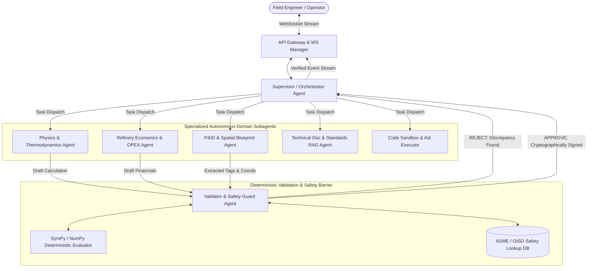
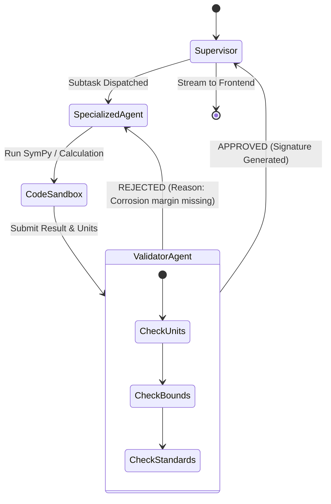

# 🤖 Multi-Agent Specification & Interaction Protocol
**Document Code:** `docs/02_MULTI_AGENT_SPECIFICATION.md`  
**System:** Sovereign On-Premise AI Workbench (SIH26117)  
**Target:** LangGraph State Machine, Autonomous Agent Contracts, & Validation Loops  

---

## 1. Multi-Agent Topology & Structural Design

The workbench replaces fragile single-prompt LLM execution with a **Hierarchical Swarm with Deterministic Verification Loop**. 



---

## 2. Shared LangGraph State Schema (`AgentState`)

All agents operate over a single, immutable, typed state schema defined in `ai_engine/state.py`:

```python
from typing import Annotated, Sequence, TypedDict, Optional, Dict, Any, List
from langchain_core.messages import BaseMessage
import operator

class AgentTelemetry(TypedDict):
    prompt_tokens: int
    completion_tokens: int
    total_tokens: int
    tps: float
    duration_ms: float
    vram_used_mb: int

class AgentState(TypedDict):
    # Core Chat & Communication
    messages: Annotated[Sequence[BaseMessage], operator.add]
    session_id: str
    workspace_id: str
    
    # Routing & Orchestration
    current_intent: str
    active_agent: str
    next_step: Optional[str]
    plan: List[str]
    step_index: int
    
    # Context & Retrieved Data
    rag_documents: List[Dict[str, Any]]
    spatial_entities: List[Dict[str, Any]]   # Extracted P&ID tags, coordinates, bounding boxes
    extracted_tables: List[str]              # Structured Markdown tables
    
    # Deterministic Execution & Math
    sympy_expressions: List[str]
    calculation_results: Dict[str, Any]
    validation_status: str                   # 'PENDING' | 'APPROVED' | 'REJECTED'
    validation_errors: List[str]
    
    # Safety & Telemetry
    requires_human_approval: bool
    audit_hash: str
    telemetry: AgentTelemetry
```

---

## 3. Subagent Specifications & Behavioral Contracts

### 3.1 `SupervisorAgent` (The Orchestrator)
- **Role:** Analyzes raw incoming messages, decomposes complex requests into DAG sub-tasks, assigns execution to domain agents, and compiles the final verified output.
- **Model:** Tier 2 (`qwen2.5:7b-instruct-q4_K_M` or `llama3.1:8b`).
- **Prompt Philosophy:** Acts as the Refinery Chief Operating Officer. Strictly forbids producing answers to mathematical physics without routing to `PhysicsAgent` + `ValidatorAgent`.
- **Decision Logic:**
  ```python
  def route_supervisor(state: AgentState) -> str:
      if state.get("validation_status") == "REJECTED":
          return "reflect_and_correct"
      if state.get("requires_human_approval"):
          return "human_in_the_loop_barrier"
      return state.get("next_step", "compile_final_response")
  ```

---

### 3.2 `PhysicsMathAgent` (Thermodynamics & Structural Mechanics)
- **Role:** Evaluates ASME Section VIII Division 1 & 2 pressure vessel calculations, Larson-Miller creep rupture life, and Darcy-Weisbach head loss.
- **Model:** Tier 2 (`qwen2.5:7b`) with SymPy code-generation prompt.
- **Tool Bindings:**
  - `sympy_pressure_vessel_solver(pressure, radius, stress, efficiency)`
  - `larson_miller_creep_calc(temperature_c, operating_hours, material_constant)`
  - `fluid_flow_head_loss(pipe_diameter, velocity, friction_factor, length)`
- **Behavioral Contract:** Never outputs raw arithmetic numbers. Emits:
  1. Symbolic LaTeX formula ($$t = \frac{P \cdot R}{S \cdot E - 0.6 \cdot P}$$)
  2. Substituted numerical values
  3. SymPy execution code for deterministic evaluation in `SandboxAgent`

---

### 3.3 `EconomicsAgent` (Refinery Operational Financials)
- **Role:** Models downtime financial penalties, crude yield optimization, energy efficiency gains, and steam generation utility costs.
- **Model:** Tier 1/2 (`qwen2.5:1.5b` or `7b`).
- **Tool Bindings:**
  - `calculate_unplanned_shutdown_cost(unit_name, downtime_hours, crude_barrel_rate)`
  - `fuel_gas_vs_steam_efficiency_tradeoff(steam_tons, fuel_gas_mmbtu)`
  - `generate_chart_spec(chart_type, labels, datasets, unit)`
- **Output Schema:** Emits structured JSON compatible with the frontend Chart.js / Recharts widget.

---

### 3.4 `PIDCanvasAgent` (Spatial Computer Vision & Blueprint Analysis)
- **Role:** Analyzes Piping & Instrumentation Diagrams (P&IDs) and isometric engineering blueprints.
- **Model:** Tier 3 (`qwen2-vl:7b`) coupled with the isolated Python 3.11 PaddleOCR worker.
- **Tool Bindings:**
  - `query_spatial_tag(tag_name)`: Returns normalized `[ymin, xmin, ymax, xmax]` coordinates for SVG canvas highlighting.
  - `extract_connected_loop(start_tag, max_hops)`: Traces upstream and downstream equipment connections.
- **Behavioral Contract:** Maps OCR bounding boxes to standard ISA 5.1 instrumentation symbols (e.g., Circle = Field Mounted Instrument, Diamond = Distributed Control System).

---

### 3.5 `ValidatorAgent` (The Deterministic Safety Gate)
- **Role:** Independent safety verification layer. Intercepts draft agent outputs before they reach the user.
- **Verification Criteria:**
  1. **Units Consistency:** Asserts consistent engineering units (MPa vs. PSI, Celsius vs. Kelvin).
  2. **Physical Boundary Checks:** Rejects calculations exceeding safety bounds (e.g., negative wall thickness, temperature below absolute zero, efficiency $E > 1.0$).
  3. **Safety Margins:** Asserts mandatory corrosion allowance ($c \ge 3.0\text{ mm}$ for sour crude service per MRPL standards).
- **Fallback Action:** If validation fails, injects a critical error back into `AgentState["validation_errors"]` and sends the state back to the executing agent for an automated self-correction reflection cycle.

---

## 4. Self-Correction & Reflection Loop



---

## 5. Failure Recovery & Graceful Degradation Matrix

| Failure Mode | Detection Point | Automated Recovery Strategy |
|---|---|---|
| **CV Worker Crash (`.venv-cv`)** | Subprocess timeout (>15s) or exit code $\ne 0$ | Fallback to PyMuPDF fast text extraction. Notify user: *Spatial P&ID detection degraded to text mode.* |
| **Ollama Out of VRAM (CUDA OOM)** | `500 Internal Server Error` from Ollama | Automatically flush Ollama VRAM (`ollama stop`), re-route to Tier 1 quantized model (`qwen2.5:1.5b`), and log telemetry warning. |
| **SymPy Syntax Exception** | Python AST Sandbox exception | Validator catches error, formats traceback into agent prompt, and requests alternative formulation (up to 2 retries). |
| **Infinite Reflection Loop** | `state["step_index"] >= 3` in Validator | Break loop, flag output with a prominent Amber Alert in UI, and present the draft calculation to the human operator for manual review. |
