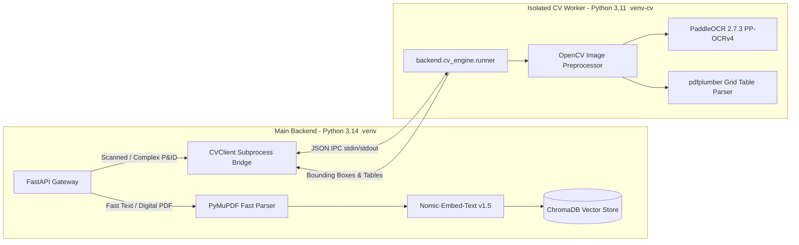

# 👁️ Ingestion Pipeline & Spatial Computer Vision Specification
**Document Code:** `docs/03_DATA_PIPELINE_AND_SPATIAL_CV.md`  
**System:** Sovereign On-Premise AI Workbench (SIH26117)  
**Target:** Dual-Python Ingestion, PaddleOCR 2D Spatial Grounding, & Vector RAG Pipeline  

---

## 1. The Industrial Data Problem

Standard enterprise RAG pipelines fail in heavy engineering environments because industrial documents are **heterogeneous, dense, and non-linear**:
1. **Piping & Instrumentation Diagrams (P&IDs)**: Information is encoded in 2D spatial relationships, flow arrows, and equipment tag loops (`B-401` $\to$ `V-102`), not sequential paragraphs.
2. **Dense Technical Tables**: Heat exchanger data sheets and ASME allowable stress tables lose all grid relationships when flattened to raw text.
3. **Scanned Hardcopy Blueprints**: Scans contain skew, analog noise, low contrast, and small font sizes (6pt–8pt).

---

## 2. Dual-Engine Architecture & Technology Separation

To achieve zero dependency conflicts and rock-solid stability, the ingestion pipeline splits tasks across two isolated Python virtual environments:



### Rationale for Environment Isolation:
- **PaddleOCR 2.7.3 & PaddlePaddle** require Python 3.11 C-extensions and `numpy < 2.0.0`.
- **FastAPI, LangGraph, & modern async libraries** run on modern Python 3.14 with `numpy >= 2.0.0`.
- Running them in separate runtimes completely prevents binary DLL clashes on Windows and Linux hosts.

---

## 3. The 4-Stage Ingestion Pipeline

### Stage 1: Preprocessing & Contrast Normalization (OpenCV)
Before OCR processing, blueprint images undergo automated image enhancement:
1. **Adaptive Histogram Equalization (CLAHE)**: Enhances local contrast in faded blueprint blueprints.
2. **Deskewing**: Uses Hough line transform to detect document rotation angles and rotates pages to $0.0^\circ$.
3. **DPI Rescaling**: Upscales low-resolution scans to an optimal 300 DPI for high-confidence optical recognition.

### Stage 2: 2D Spatial Grounding (PaddleOCR)
PaddleOCR extracts text tokens with exact 4-point polygon bounding boxes:
- Output coordinates are normalized to relative `[ymin, xmin, ymax, xmax]` format (from $0.0$ to $1.0$).
- Enables the frontend **Interactive Canvas** to render clickable, highlighted bounding boxes directly over equipment tags (`PRV-102`, `HX-201`).

### Stage 3: Structural Table Extraction (`pdfplumber`)
- Analyzes vertical and horizontal table lines to reconstruct dense technical matrices.
- Converts raw table cells into clean, GitHub-flavored Markdown tables.
- Preserves column alignments and merged headers (critical for ASME allowable stress lookup tables).

### Stage 4: Semantic Chunking & Vectorization
- **Chunking Strategy**: Recursive Character Splitter with semantic header preservation (`#`, `##`, `###`).
- **Chunk Size**: 512 tokens with 50-token sliding overlap.
- **Metadata Tagging**: Each chunk is indexed in ChromaDB with rich metadata:
  ```json
  {
    "document_id": "doc_asme_sec_viii_2024",
    "filename": "ASME_Section_VIII_Div_1.pdf",
    "page_number": 42,
    "chunk_type": "table | text | pid_diagram",
    "detected_tags": ["B-401", "PRV-102", "ASME-UG27"],
    "sha256": "e3b0c44298fc1c149afbf4c8996fb92427ae41e4649b934ca495991b7852b855"
  }
  ```

---

## 4. Subprocess IPC Bridge Protocol

The main gateway communicates with the isolated CV worker using transient JSON IPC:

### Command Invocation (from Gateway):
```python
# backend/app/services/cv_client.py
import subprocess
import json

def extract_spatial_features(image_path: str, cv_venv_python: str) -> dict:
    cmd = [
        cv_venv_python,
        "-m", "backend.cv_engine.runner",
        "--input", image_path,
        "--detect-tables", "true",
        "--ocr-lang", "en"
    ]
    proc = subprocess.run(cmd, capture_output=True, text=True, timeout=30)
    if proc.returncode != 0:
        raise RuntimeError(f"CV Engine Error: {proc.stderr}")
    return json.loads(proc.stdout)
```

### JSON Response Schema:
```json
{
  "status": "success",
  "execution_time_ms": 1420.5,
  "page_count": 1,
  "spatial_entities": [
    {
      "text": "CRUDE DISTILLATION COLUMN C-101",
      "bbox_normalized": [0.12, 0.35, 0.15, 0.65],
      "confidence": 0.992,
      "isa_category": "VESSEL"
    },
    {
      "text": "PRV-102",
      "bbox_normalized": [0.45, 0.52, 0.47, 0.56],
      "confidence": 0.985,
      "isa_category": "SAFETY_VALVE"
    }
  ],
  "tables": [
    {
      "page": 1,
      "markdown": "| No. | Tag | Rating | Set Pressure |\n| 1 | PRV-102 | Class 300 | 18.5 bar |"
    }
  ]
}
```

---

## 5. ChromaDB Vector Store Architecture

- **Collection Organization**: Partitioned per workspace (`workspace_{workspace_id}`).
- **Embedding Model**: `nomic-embed-text:v1.5` running locally in Ollama (768 dimensions, 8,192 context window).
- **Hybrid Search**: Fuses dense vector cosine similarity with exact BM25 keyword matching for high-precision technical tag lookups (`PRV-102`, `ASME UG-27`).
