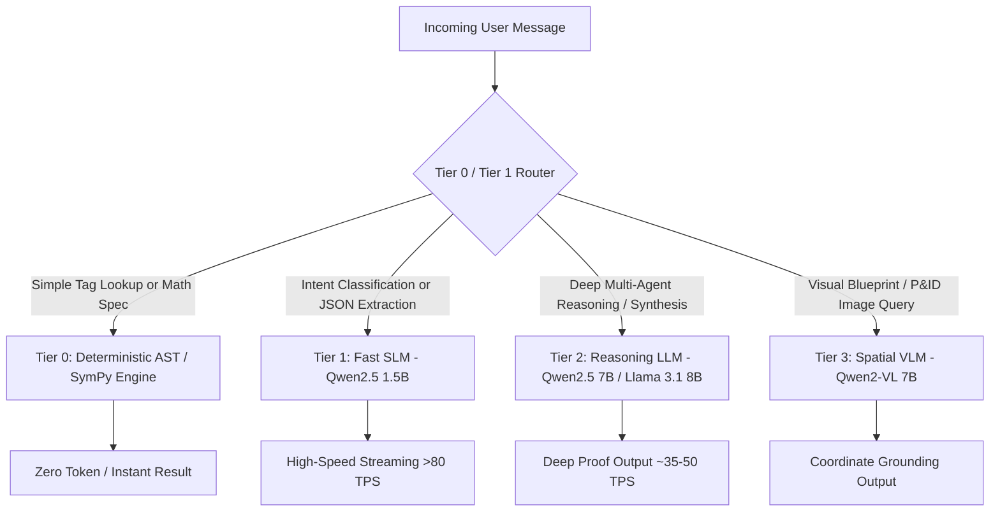

# ⚡ Tokenomics, Context Governance & Inference Optimization
**Document Code:** `docs/04_TOKENOMICS_AND_INFERENCE_BUDGET.md`  
**System:** Sovereign On-Premise AI Workbench (SIH26117)  
**Target:** Local Ollama Token Management, Context Pruning, & Telemetry Streaming  

---

## 1. The Token Dilemma in Edge & On-Premise Inference

Unlike hyperscale cloud APIs with practically unlimited compute, **on-premise workstations have strict hardware limits**:
- Workstations typically feature 16 GB to 32 GB VRAM (RTX 4080 / RTX 4090 or A4000).
- Running dense 32k context windows causes quadratic memory growth in KV-cache ($O(N^2)$), triggering out-of-memory (CUDA OOM) crashes or severe throughput degradation (dropping from 45 TPS to <5 TPS).
- Naively dumping 10 PDF chunks into an LLM prompt burns 6,000+ tokens per turn, depleting memory and slowing down inference.

---

## 2. Multi-Model Tiering Matrix (Speculative Routing)

Instead of using one 7B/8B model for all tasks, the workbench uses a **3-Tier Dynamic Routing Hierarchy**:



### Model Performance & Resource Specifications:
| Tier | Model Identifier | Quantization | Context Window | VRAM Footprint | Target TPS | Primary Responsibility |
|---|---|---|---|---|---|---|
| **Tier 0** | SymPy / Python 3.14 | N/A | $\infty$ | ~50 MB RAM | Instant (<5ms) | Exact arithmetic, unit conversions, formula proofs |
| **Tier 1 (SLM)** | `qwen2.5:1.5b-instruct` | `q4_K_M` | 8,192 | ~1.4 GB | 80–110 TPS | Intent classification, structured JSON repair, guardrails |
| **Tier 2 (LLM)** | `qwen2.5:7b-instruct` | `q4_K_M` | 32,768 | ~5.2 GB | 35–50 TPS | Supervisor planning, engineering explanation, code synthesis |
| **Tier 3 (VLM)** | `qwen2-vl:7b-instruct` | `q4_K_M` | 8,192 | ~5.8 GB | 20–30 TPS | P&ID visual comprehension, schematic node detection |
| **Embeddings** | `nomic-embed-text:v1.5` | `F16` | 8,192 | ~1.1 GB | N/A (Batch) | Dense vector encoding for ChromaDB |

---

## 3. Dynamic Context Budgeting Protocol

Every conversational turn is allocated a strict **Context Budget** to prevent VRAM spikes:

```
Total Context Window (e.g., 16,384 Tokens)
├── [0000 - 0800] System Prompt & Strict Engineering Persona (800 tokens fixed)
├── [0801 - 4800] Retrieved RAG Chunks & Spatial Entities (4,000 tokens max)
├── [4801 - 12800] Prior Working Conversation Memory (8,000 tokens dynamic)
└── [12801 - 16384] Output Generation Reserve (3,584 tokens reserve)
```

### Extractive Context Auto-Compaction:
When cumulative conversation history exceeds 8,000 tokens:
1. The **Token Governor** executes an automated extractive summary over turns $1 \dots N-2$.
2. It strips conversational chatter while preserving technical constants:
   - Equipment IDs (`B-401`, `PRV-102`)
   - Numerical values and units (`18.5 bar`, `450°C`)
   - Selected material grades (`SA-516 Grade 70`)
3. The compressed history is injected as a high-density summary block:
   ```markdown
   [PRIOR SESSION STATE COMPACTED]
   - Target Equipment: Boiler Drum B-401
   - Design Pressure: 18.5 MPa | Operating Temp: 450°C
   - Material: SA-516 Grade 70 (Allowable Stress S = 118 MPa)
   - Corrosion Allowance specified: 3.0 mm
   ```

---

## 4. Real-Time Hardware & Token Telemetry Streaming

The backend continuously streams tokenomics and GPU health metrics over the WebSocket bus via `backend/app/services/telemetry.py`:

```json
{
  "event": "telemetry_tick",
  "data": {
    "tokens_per_second": 46.8,
    "prompt_tokens": 1240,
    "completion_tokens": 318,
    "total_session_tokens": 14280,
    "estimated_cost_saved_usd": 0.428,
    "gpu_metrics": {
      "vram_used_mb": 6140,
      "vram_total_mb": 16384,
      "vram_utilization_pct": 37.4,
      "gpu_temp_c": 62,
      "gpu_power_watts": 145
    }
  }
}
```

The frontend status bar renders these metrics live, showing judges and plant operators real-time system performance and hardware efficiency.
