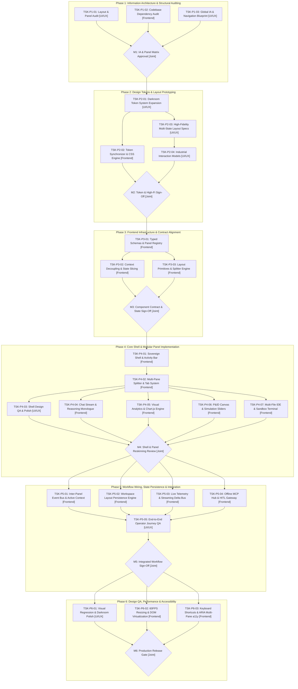

# 🏗️ Sovereign AI Engineering Workbench — UI/UX & Frontend Execution Plan
**Document Code:** `docs/WORKBENCH_EXECUTION_PLAN_UI_UX_FRONTEND.md`  
**System:** Sovereign On-Premise AI Engineering Workbench (SIH26117)  
**Target Facility:** High-Hazard Industrial Plants (e.g., Mangalore Refinery & Petrochemicals Limited - MRPL)  
**Compliance Standards:** Zero-Egress Air-Gap, ASME Section VIII Div 1 & 2, OISD-156, OSHA 1910.119  
**Design Aesthetic:** "Darkroom Editorial" (`#181410`, `#D97A3F`, Fraunces, General Sans/Söhne, JetBrains Mono)  
**Authors:** Staff Technical Lead & Principal Systems Architect  

---

## 1. Executive Summary & Architectural Context

### 1.1 The Architectural Transition
Following the system specification overhaul documented in `docs/` and `docs/future_updates/`, the Sovereign AI Workbench is transitioning from a conversational chat prototype into an **Active Industrial Command Center**. This transformation restructures the application across five operational pillars:
1. **Dynamic Multi-Pane Workspace Shell**: Replacing rigid split views with a modular panel docking/layout manager capable of hosting live telemetry, chat streams, spatial blueprints, visual analytics, and sandbox terminals simultaneously.
2. **Deterministic Multi-Agent Swarm Visualization**: Surfacing real-time telemetry (TPS, VRAM, GPU temperature), Supervisor thought traces, and SymPy/ASME verification loops directly within the viewport.
3. **Interactive Visual Analytics & P&ID Digital Twin**: Embedding interactive Chart.js widgets and an interactive SVG Piping & Instrumentation Diagram (P&ID) with bi-directional parameter sliders and ASME Section VIII operating envelopes.
4. **Air-Gapped Agency & Human-In-The-Loop (HITL) Gateways**: Formal approval modals for Model Context Protocol (MCP) local tools (`smtp_mcp`, `alert_mcp`, `historian_mcp`) backed by cryptographic SHA-256 Merkle audit chains.
5. **Zero-Regression Stability**: Decoupling the monolithic state context into cleanly isolated domain stores to guarantee that existing operational features (chat, attachments, code inspection) continue functioning without interruption.

---

## 2. Chronological Phase Dependency Graph



---

## Phase 1: Information Architecture & Structural Auditing

### TSK-P1-01: Audit Existing Workbench Panels, Modals, & Routing
- **Role Assignment:** `[UI/UX]`
- **Input Artifact:** `docs/01_SYSTEM_ARCHITECTURE_DESIGN.md`, `docs/future_updates/PHASE_1_TRANSFORMATION.md`, `frontend/src/routes/ChatPage.tsx`, `frontend/src/components/artifact/ArtifactPanel.tsx`
- **Action Items:**
  1. Map all existing visual surfaces in the current web application: Chat Feed, Universal Input Bar, Artifact Panel (Preview, Code, Terminal tabs), Command Palette modal (`⌘K`), Settings modal (`⌘,`), Keyboard Shortcuts modal (`⌘/`), and Route pages (`/chats`, `/projects`, `/library`, `/company-docs`, `/dev-preview`).
  2. Inventory every component currently mounted inside the 54% split right pane (`ArtifactPanel.tsx`) and evaluate conflicts when multiple artifacts (e.g., SVG P&ID diagram + ASME calculation + financial chart) must be viewed concurrently.
  3. Identify structural deficiencies in the current binary 46%/54% split layout that prevent multi-pane industrial plant monitoring.
  4. Document visual inconsistencies between the Darkroom Editorial guidelines (`frontend/DESIGN.md`) and currently rendered controls.
- **Deliverables & Acceptance Criteria:**
  - Audit document (`audit_panel_inventory.md`) cataloging every UI component, current route, DOM container, and structural pain point.
  - Identification of 100% of all UI widgets that must be modularized into independent docking panels.
- **Downstream Blockers:** Blocks `TSK-P1-03`, `TSK-P2-03`, and Milestone `M1`.

---

### TSK-P1-02: Technical Inventory & Codebase Dependency Audit
- **Role Assignment:** `[Frontend]`
- **Input Artifact:** `frontend/src/lib/WorkbenchContext.tsx`, `frontend/src/lib/types.ts`, `frontend/src/components/layout/AppLayout.tsx`, `frontend/package.json`
- **Action Items:**
  1. Profile `WorkbenchContext.tsx` (1,324 lines) to map state dependencies: active chat, message streaming, artifact selection, tool configurations, audio playback, keybindings, and modal visibilities.
  2. Trace re-render propagation when real-time streaming tokens and telemetry packets arrive via WebSocket.
  3. Evaluate CSS layout constraints in `frontend/src/index.css` and `frontend/tailwind.config.ts`, auditing flexbox overflow behaviors and hard-coded pixel widths (e.g. 280px sidebar, 46%/54% split clamp).
  4. Benchmark third-party docking and layout primitive compatibility (e.g., `dockview`, CSS Grid custom splitter, `@tanstack/react-virtual`).
- **Deliverables & Acceptance Criteria:**
  - Technical audit report (`docs/audit_technical_dependencies.md`) detailing state coupling bottlenecks, DOM re-render triggers during token generation, and recommended layout primitives.
  - Baseline bundle size and frame-rate benchmark during slider dragging and split resizing.
- **Downstream Blockers:** Blocks `TSK-P3-01`, `TSK-P3-02`, and Milestone `M1`.

---

### TSK-P1-03: Global Information Architecture & Navigation Hierarchy Blueprint
- **Role Assignment:** `[UI/UX]`
- **Input Artifact:** `docs/01_SYSTEM_ARCHITECTURE_DESIGN.md`, `docs/02_MULTI_AGENT_SPECIFICATION.md`, `FUTURE_PLANS.md`, `docs/FRONTEND_UI_UX_ACTION_PLAN.md`
- **Action Items:**
  1. Define the 4-zone master workbench topology:
     - **Zone A: Persistent Activity Bar (Far Left Rail, 56px)**: High-level navigation icons, active swarm status, zero-egress security shield, settings trigger.
     - **Zone B: Primary Work Area (Center / Left, 35-50% dynamic)**: Conversational stream, Supervisor thought traces, collapsible prompt navigator, input enclave.
     - **Zone C: Modular Engineering Workspace (Center / Right, 50-65% dynamic)**: Multi-tab docking host capable of splitting horizontally and vertically for P&ID schematics, Chart.js infographics, KaTeX proofs, and multi-file code editing.
     - **Zone D: Collapsible Engineering Drawer (Bottom, 0-35% dynamic)**: Sandbox execution logs, Python terminal, audit trail inspector, and real-time hardware telemetry.
  2. Map navigation flows between conversational inquiry, artifact pop-out, full-screen canvas mode, and emergency stop actions.
  3. Produce low-fidelity wireframes detailing panel collapse/expand behaviors and activity bar tool switching.
- **Deliverables & Acceptance Criteria:**
  - Complete low-fidelity wireframe set (Figma or SVG diagrams) showing all 4 zones in default, multi-split, and focused full-screen layouts.
  - Navigation hierarchy flowchart mapping every route and panel invocation path.
- **Downstream Blockers:** Blocks `TSK-P2-03`, `TSK-P2-04`, and Milestone `M1`.

---

### TSK-P1-04: Milestone M1 — IA, Panel Layout Matrix & Handoff Agreement
- **Role Assignment:** `[Joint / Handoff]`
- **Input Artifact:** Deliverables from `TSK-P1-01`, `TSK-P1-02`, and `TSK-P1-03`
- **Action Items:**
  1. Joint architectural review between UI/UX Designer and Frontend Engineer.
  2. Formally lock panel taxonomy:
     - `panel:chat_stream`
     - `panel:pid_canvas`
     - `panel:visual_analytics`
     - `panel:code_editor`
     - `panel:sandbox_terminal`
     - `panel:telemetry_bar`
     - `panel:hitl_modal`
  3. Review and sign off on viewport breakpoints: 1440px (minimum engineering laptop baseline), 1920px (standard control room 1080p console), 2560px (refinery DCS 2K/4K multi-display console).
- **Deliverables & Acceptance Criteria:**
  - Signed-off `PANEL_TAXONOMY_SPEC.json` documenting every panel ID, min/max dimensions, default docking zone, and supported tear-off modes.
  - Zero open architectural discrepancies regarding layout zone ownership.
- **Downstream Blockers:** Blocks all Phase 2 and Phase 3 tasks.

---

## Phase 2: Design Tokens & Layout Prototyping

### TSK-P2-01: Darkroom Industrial Design Token System Expansion
- **Role Assignment:** `[UI/UX]`
- **Input Artifact:** `frontend/DESIGN.md`, `docs/FRONTEND_UI_UX_ACTION_PLAN.md`, `docs/05_AIRGAP_SECURITY_AND_ZERO_EGRESS.md`
- **Action Items:**
  1. Expand the "Darkroom Editorial" color palette with strict industrial telemetry tokens:
     - Background Deep: `#181410`
     - Surface Elevation 1 (Sidebar / Docked Cards): `#211B15`
     - Surface Elevation 2 (Floating Popovers / Modals): `#2A2219`
     - Surface Elevation 3 (Active Panel Tab / Raised Header): `#332A1F`
     - Hairline Border / Splitter Rule: `#3D3226`
     - Splitter Active Drag Highlight: `#D97A3F` (Darkroom Amber)
     - Primary Action / Selection Highlight: `#D97A3F`
     - Safety Compliant / Verified State: `#10B981` (Safety Emerald)
     - Critical / Boundary Breach / ASME Violation: `#B8443A` (Safelight Red)
     - Cryogenic / Cooling / Gas Flow: `#38BDF8` (Sky Cyan)
     - Steam Utility / Thermal High: `#F59E0B` (Amber Flame)
     - Zero-Egress Air-Gap Badge: `#059669`
  2. Standardize typography tokens:
     - Display & Section Headers: Fraunces (Optical size 14-36, weights 400-600)
     - UI Labels & Primary Body: General Sans / Söhne (Weights 400, 500, 600, line-height 1.65)
     - Telemetry, Code & Instrument Tags: JetBrains Mono (Strictly monospace, tabular numbers `font-feature-settings: "tnum"`)
  3. Define elevation, border-radius (4px cards/inputs, 2px buttons, 9999px status pills), and 8px spatial grid tokens.
- **Deliverables & Acceptance Criteria:**
  - Exported design token specification (`tokens.json`) covering colors, typography, spacing, elevations, and transition timing curves.
- **Downstream Blockers:** Blocks `TSK-P2-02`, `TSK-P2-05`, and Milestone `M2`.

---

### TSK-P2-02: Token Synchronizer & CSS Variable Architecture
- **Role Assignment:** `[Frontend]`
- **Input Artifact:** `tokens.json` (from `TSK-P2-01`), `frontend/tailwind.config.ts`, `frontend/src/index.css`
- **Action Items:**
  1. Update `frontend/src/index.css` to declare CSS custom properties for all Darkroom tokens (`--color-bg-deep`, `--color-surface-1`, `--color-surface-2`, `--color-surface-3`, `--color-border-hairline`, `--color-accent-amber`, `--color-alert-red`, `--color-safety-emerald`, `--color-flow-cyan`).
  2. Synchronize `frontend/tailwind.config.ts` to expose typed utility classes mapping to these CSS custom properties.
  3. Implement tabular numeral utilities (`font-mono`, `tabular-nums`) and film-grain overlay CSS blend-mode classes (`mix-blend-screen`).
  4. Ensure darkroom styling applies consistently to scrollbars, input selections, and tooltips.
- **Deliverables & Acceptance Criteria:**
  - Updated `frontend/tailwind.config.ts` and `frontend/src/index.css` with 100% token coverage.
  - Automated type definitions for design tokens in `frontend/src/lib/tokens.ts`.
- **Downstream Blockers:** Blocks `TSK-P3-03`, `TSK-P4-01`, and Milestone `M2`.

---

### TSK-P2-03: High-Fidelity Layout Specs for All Viewport States
- **Role Assignment:** `[UI/UX]`
- **Input Artifact:** `PANEL_TAXONOMY_SPEC.json` (from `TSK-P1-04`), `docs/FRONTEND_UI_UX_ACTION_PLAN.md`
- **Action Items:**
  1. Produce pixel-precise high-fidelity mockups in Figma for all viewport layouts:
     - **Layout State A (Docked Tri-Pane Baseline)**: 56px Activity Bar + 38% Chat Stream + 42% P&ID/Artifact Canvas + 20% Telemetry/Status Tray.
     - **Layout State B (Collapsed Activity Rail & Focus Workspace)**: 0px Activity Bar + 28% Chat Thread + 72% Visual Analytics / P&ID Canvas.
     - **Layout State C (Full-Screen Industrial Canvas Mode)**: P&ID diagram or 3D digital twin expanded to 100% viewport width with floating translucent HUD overlays.
     - **Layout State D (Multi-File Code & Sandbox Execution Mode)**: Side-by-side split code editor (50%) + live terminal logs (50%) in the workspace zone.
     - **Layout State E (Human-In-The-Loop Modal Overlay)**: High-contrast modal with raw parameter preview and cryptographic sign-off controls.
  2. Specify exact pane header styling: 14px uppercase label, wide tracking (0.08em), active amber indicator bar, panel action icons (maximize, minimize, close, pop-out).
- **Deliverables & Acceptance Criteria:**
  - High-fidelity component and screen specifications in Figma covering all 5 layout states across 1440px, 1920px, and 2560px resolutions.
- **Downstream Blockers:** Blocks `TSK-P2-04`, `TSK-P4-01`, and Milestone `M2`.

---

### TSK-P2-04: Industrial Interaction Models Specification
- **Role Assignment:** `[UI/UX]`
- **Input Artifact:** `docs/future_updates/PHASE_2_TRANSFORMATION.md`, `frontend/DESIGN.md` Section 6
- **Action Items:**
  1. Design drag-and-drop splitter interaction:
     - 4px invisible grab zone expanding to 1px visible amber rule during hover.
     - Active drag state: 2px solid `#D97A3F` rule with dynamic percentage tooltip (`46.2% | 53.8%`).
  2. Detail P&ID Canvas navigation:
     - Smooth pan (middle-click or space+drag) and mouse-wheel zoom (clamped between 25% and 800%).
     - Equipment beacon animation: 3-cycle pulse ring (`#D97A3F` or `#B8443A`) centering on searched instrument tags (`PRV-102`, `B-401`).
  3. Detail simulation slider interaction:
     - Real-time dragging with instant numerical readout above thumb.
     - ASME operating envelope boundary breach: thumb transitions to `#B8443A` with tactile micro-shake animation.
  4. Specify empty states, skeleton loaders, and error fallbacks for each panel type.
- **Deliverables & Acceptance Criteria:**
  - Interaction specification document (`INTERACTION_SPEC.md`) containing micro-animation timings (150ms-250ms ease-out), slider debounce specs (16ms / 60fps), and state transition rules.
- **Downstream Blockers:** Blocks `TSK-P4-02`, `TSK-P4-05`, `TSK-P4-06`, and Milestone `M2`.

---

### TSK-P2-05: Milestone M2 — Token Package & High-Fidelity Prototype Sign-Off
- **Role Assignment:** `[Joint / Handoff]`
- **Input Artifact:** Deliverables from `TSK-P2-01`, `TSK-P2-02`, `TSK-P2-03`, and `TSK-P2-04`
- **Action Items:**
  1. Review live token compilation in frontend storybook/dev-preview.
  2. Inspect high-fidelity prototype flows in Figma against all industrial requirements.
  3. Validate contrast ratios: Ensure `#D8CDBC` body text on `#181410` background satisfies WCAG AAA (contrast ratio > 7:1) and `#D97A3F` on `#211B15` meets WCAG AA (> 4.5:1).
- **Deliverables & Acceptance Criteria:**
  - Formal sign-off on design prototypes and token build.
  - Zero ambiguous layout states or unstyled controls remaining in specifications.
- **Downstream Blockers:** Blocks all Phase 3 and Phase 4 implementation tasks.

---

## Phase 3: Frontend Infrastructure & Contract Alignment

### TSK-P3-01: Typed Domain Schemas & Panel Registry Architecture
- **Role Assignment:** `[Frontend]`
- **Input Artifact:** `docs/01_SYSTEM_ARCHITECTURE_DESIGN.md` Section 3, `docs/02_MULTI_AGENT_SPECIFICATION.md` Section 2, `docs/MCP_APPROVAL_CONTRACT.md`, `frontend/src/lib/types.ts`
- **Action Items:**
  1. Refactor and expand `frontend/src/lib/types.ts` with strict TypeScript types for all incoming and outgoing messages:
     - `WorkbenchPanelId`: Union type (`'chat_stream' | 'visual_analytics' | 'pid_canvas' | 'code_editor' | 'sandbox_terminal' | 'telemetry_status' | 'hitl_approval'`).
     - `PanelDockPosition`: `'left' | 'center' | 'right' | 'bottom' | 'floating'`.
     - `PanelConfig`: Title, icon, closable, dockPosition, minWidth, minHeight, defaultDimensions, zIndex.
     - `WebSocketEventEnvelope`: Typed discriminators (`'agent_stream_chunk' | 'thought_trace' | 'tool_call_started' | 'tool_call_finished' | 'telemetry_tick' | 'mcp_approval' | 'mcp_execution_result'`).
     - `TelemetryPayload`: Active TPS, VRAM allocated MB, GPU temperature Celsius, air-gap zero-egress state.
     - `McpApprovalPayload`: Tool call ID, server, tool name, parameters, security level (`'standard' | 'elevated' | 'critical'`), expiration timestamp.
  2. Construct a central, extensible `PanelRegistry` map linking panel IDs to lazy-loaded React component implementations with fallback error boundaries.
- **Deliverables & Acceptance Criteria:**
  - Comprehensive, strictly typed `frontend/src/lib/types.ts` with zero `any` declarations for core workbench communication.
  - Initialized `frontend/src/lib/panelRegistry.tsx` exporting registered panel descriptors.
- **Downstream Blockers:** Blocks `TSK-P3-02`, `TSK-P4-01`, and `TSK-P4-02`.

---

### TSK-P3-02: State Slicing & Context Decoupling
- **Role Assignment:** `[Frontend]`
- **Input Artifact:** `frontend/src/lib/WorkbenchContext.tsx`, `TSK-P3-01`
- **Action Items:**
  1. Deconstruct the monolithic 1,324-line `WorkbenchContext.tsx` into modular, domain-specific state stores (using React Context or Zustand):
     - **`PanelLayoutStore`**: Manages open panels, active tabs, splitter split percentages, docking positions, and full-screen focus states.
     - **`SessionStore`**: Manages chat history, active session ID, conversation titles, and message queues.
     - **`TelemetryStore`**: High-frequency store updating TPS, VRAM, and GPU temps without triggering re-renders in the chat or editor trees.
     - **`HITLStore`**: Manages pending human-in-the-loop approvals, countdown timers, and dispatch decisions.
     - **`ArtifactStore`**: Manages active artifact files, multi-file tabs, diff views, and sandbox run logs.
  2. Implement state selectors to prevent unnecessary re-rendering across independent panels during token streaming.
  3. Maintain backward-compatible adapter wrappers so existing components continue to function during phased migration.
- **Deliverables & Acceptance Criteria:**
  - 5 decoupled store modules in `frontend/src/lib/stores/`.
  - Profiling proof that receiving high-frequency telemetry ticks (every 1.5s) re-renders only the telemetry widget, with 0 re-renders in `ChatPage.tsx` or `ArtifactPanel.tsx`.
- **Downstream Blockers:** Blocks `TSK-P4-01`, `TSK-P5-01`, and `TSK-P5-02`.

---

### TSK-P3-03: Layout Primitives & Splitter Engine Setup
- **Role Assignment:** `[Frontend]`
- **Input Artifact:** `INTERACTION_SPEC.md` (from `TSK-P2-04`), `PANEL_TAXONOMY_SPEC.json`
- **Action Items:**
  1. Implement a performant, virtualized split layout container (`WorkbenchSplitLayout.tsx`) supporting:
     - Horizontal and vertical nested splits.
     - Fluid dragging with pointer capture (`setPointerCapture`) to prevent cursor slipping across iframe or canvas borders.
     - Clamped percentage limits (min 15%, max 85%) preventing panel collapse traps.
     - Double-click to reset splitter to default balance (e.g. 50/50 or 46/54).
     - Keyboard accessibility: Arrow keys resize focused splitter by 1% increments (Shift+Arrow by 5%).
  2. Implement CSS subgrid / container query support to allow docked components to automatically adapt their internal visual density based on current pane width.
- **Deliverables & Acceptance Criteria:**
  - Reusable layout primitives in `frontend/src/components/layout/splitter/` with zero layout thrashing or lag.
  - Storybook / DevPreview test page demonstrating 4-way simultaneous resizing at steady 60fps.
- **Downstream Blockers:** Blocks `TSK-P4-01`, `TSK-P4-02`, and Milestone `M3`.

---

### TSK-P3-04: Milestone M3 — Component Contract & State Sign-Off
- **Role Assignment:** `[Joint / Handoff]`
- **Input Artifact:** Deliverables from `TSK-P3-01`, `TSK-P3-02`, and `TSK-P3-03`
- **Action Items:**
  1. Joint technical walk-through of store boundaries and component props contracts.
  2. Verify that UI/UX expectations for layout resizing, panel snapping, and responsive container queries are fully supported by the frontend engine.
  3. Validate that existing unit tests and mock workflows pass without regression.
- **Deliverables & Acceptance Criteria:**
  - Component API contract document approved by both leads.
  - Zero blocking architectural defects in layout primitives or store architecture.
- **Downstream Blockers:** Blocks all Phase 4 panel implementation tasks.

---

## Phase 4: Core Shell & Modular Panel Implementation

### TSK-P4-01: Sovereign Workbench Shell & Persistent Activity Bar Implementation
- **Role Assignment:** `[Frontend]`
- **Input Artifact:** `TSK-P2-03`, `TSK-P3-01`, `TSK-P3-02`, `frontend/src/components/layout/AppLayout.tsx`, `frontend/src/components/layout/Sidebar.tsx`
- **Action Items:**
  1. Re-architect `AppLayout.tsx` to host the persistent 56px **Activity Bar** on the far left:
     - Icon triggers: Chat Stream (`⌘1`), Plant P&ID Canvas (`⌘2`), Visual Analytics (`⌘3`), Multi-File Editor (`⌘4`), Offline MCP Hub (`⌘5`), Company Docs (`⌘6`).
     - Bottom actions: User Profile badge, Settings (`⌘,`), Keyboard Shortcuts (`⌘/`), and Zero-Egress Air-Gap Shield indicator.
  2. Build collapsible secondary drawer (280px) that slides out smoothly next to the Activity Bar when navigating sessions, projects, or file libraries.
  3. Embed persistent analog film-grain overlay (`FilmGrain.tsx`) across the global shell with `pointer-events-none`.
- **Deliverables & Acceptance Criteria:**
  - Modernized workbench shell (`SovereignWorkbenchShell.tsx`) housing Activity Bar, secondary drawer, and workspace canvas.
  - Hotkey navigation (`⌘1` through `⌘6`) instantly switches active panel views.
- **Downstream Blockers:** Blocks `TSK-P4-02`, `TSK-P4-03`, and Milestone `M4`.

---

### TSK-P4-02: Multi-Pane Splitter & Tab Management System
- **Role Assignment:** `[Frontend]`
- **Input Artifact:** `TSK-P3-03`, `TSK-P4-01`, `frontend/src/components/artifact/ArtifactPanel.tsx`
- **Action Items:**
  1. Implement `WorkbenchTabStrip.tsx`:
     - Clean tab bar with Fraunces/General Sans typography, uppercase 12px titles, and active amber underline indicators.
     - Tab actions: Close tab (`×`), Pin tab, Maximize panel to full-screen, and Split horizontally/vertically.
     - Unsaved dirty indicator (amber dot `•`) for modified code files.
  2. Integrate `WorkbenchSplitLayout.tsx` into the main workspace area, allowing users to dock panels side-by-side or stacked top-to-bottom.
  3. Implement panel drag-and-drop tab reordering with smooth drop-target preview indicators.
- **Deliverables & Acceptance Criteria:**
  - Fully functioning multi-pane docking system supporting arbitrary horizontal/vertical splits and tab management.
  - Fluid dragging and tab reordering without state loss or component unmounting.
- **Downstream Blockers:** Blocks `TSK-P4-04`, `TSK-P4-05`, `TSK-P4-06`, `TSK-P4-07`, and `TSK-P4-03`.

---

### TSK-P4-03: Shell Design QA & Polish
- **Role Assignment:** `[UI/UX]`
- **Input Artifact:** Working shell from `TSK-P4-01` and `TSK-P4-02`, `TSK-P2-03`
- **Action Items:**
  1. Inspect Activity Bar icon alignments, active state indicators (thin left amber bar), and hover micro-animations.
  2. Audit splitter handle visual feedback: verify hairline 1px `#3D3226` rule, hover expansion, and dragging amber line.
  3. Review tab bar typography, tab overflow dropdowns, and responsive behavior under narrow pane widths.
  4. Provide exact CSS adjustments for padding, border weights, and drop shadow elimination.
- **Deliverables & Acceptance Criteria:**
  - Design review ticket listing approved visual polish adjustments and verifying 100% compliance with Darkroom Editorial design system.
- **Downstream Blockers:** Blocks Milestone `M4`.

---

### TSK-P4-04: Panel Migration: Conversational Stream & Thinking Monologue
- **Role Assignment:** `[Frontend]`
- **Input Artifact:** `frontend/src/components/chat/MessageBlock.tsx`, `frontend/src/components/chat/ThinkingIndicator.tsx`, `frontend/src/components/chat/InputBar.tsx`, `frontend/src/components/chat/QueueBar.tsx`
- **Action Items:**
  1. Refactor `ChatPage.tsx` conversational feed into an independent, modular `ChatStreamPanel.tsx`.
  2. Modernize `ThinkingIndicator.tsx`:
     - Render multi-agent reasoning steps (e.g. *"Checking ASME Section VIII UG-27 allowable stress tables..."*).
     - Asymmetric pulsing amber dot with collapsible monologue trace.
     - Live execution timers and latency metrics per agent.
  3. Upgrade `MessageBlock.tsx`:
     - Clean flat card styling on Elevation 1 with hairline top rule.
     - Audio playback button connecting to `AudioPlaybackContext.tsx`.
     - Direct action links: `[Open in Visual Canvas →]`, `[Inspect P&ID Tag →]`, `[View KaTeX Proof →]`.
  4. Preserve Universal Input Bar with slash-command popover (`/explain`, `/refactor`, `/asme`, `/haop`, `/audit`).
- **Deliverables & Acceptance Criteria:**
  - Standalone `ChatStreamPanel.tsx` dockable in any zone.
  - Zero regressions in message streaming, attachment handling, or voice dictation.
- **Downstream Blockers:** Blocks Milestone `M4` and `TSK-P5-01`.

---

### TSK-P4-05: Panel Migration: Interactive Visual Analytics Engine
- **Role Assignment:** `[Frontend]`
- **Input Artifact:** `docs/future_updates/PHASE_2_TRANSFORMATION.md` Section 2.1, `frontend/src/components/chat/InteractiveChartCard.tsx`, `frontend/src/components/chat/InfographicsCard.tsx`
- **Action Items:**
  1. Build a dedicated `VisualAnalyticsPanel.tsx` capable of rendering dynamic Chart.js visualizations:
     - 2D Heatmaps / Matrix visualizers (heat exchanger tube-bundle fouling intensity, 24-hour alarm density).
     - Multi-axis & Radar charts (boiler stress comparisons, crude distillation fractions).
     - Stacked Bar & Line charts (refinery throughput vs. design capacity, steam utility costs).
  2. Implement dual-mode visual rendering:
     - **Interactive Mode**: Dynamic Chart.js canvas with hover tooltips and dataset filtering.
     - **Static / Seaborn Mode**: Matplotlib/Seaborn output viewer with darkroom film border, high-resolution zoom/pan lightbox, and collapsible raw data table flyout.
  3. Add 1-click export tray: SVG vector export, high-res PNG download, and raw CSV data download.
- **Deliverables & Acceptance Criteria:**
  - Production-ready `VisualAnalyticsPanel.tsx` rendering all chart formats with the darkroom color palette.
  - Smooth chart re-sizing during panel divider dragging without visual distortion or memory leaks.
- **Downstream Blockers:** Blocks Milestone `M4` and `TSK-P5-01`.

---

### TSK-P4-06: Panel Migration: Spatial P&ID Canvas & Simulation Sliders
- **Role Assignment:** `[Frontend]`
- **Input Artifact:** `docs/future_updates/PHASE_2_TRANSFORMATION.md` Section 2.2, `frontend/src/components/chat/InteractivePidCanvas.tsx`, `frontend/src/components/chat/InteractivePhysicsCard.tsx`
- **Action Items:**
  1. Build a dedicated `PIDCanvasPanel.tsx` hosting interactive SVG engineering schematics:
     - High-performance SVG pan and zoom engine.
     - Equipment node tagging: clickable SVG glyphs (`B-401 Boiler`, `PRV-102 Relief Valve`, `CDU-101 Column`).
     - Animated amber/red focus beacon centering on coordinates returned by spatial vision agents.
  2. Embed the **Live Simulation Slider Enclave**:
     - Real-time temperature slider ($300^\circ\text{C} \longleftrightarrow 550^\circ\text{C}$) and pressure slider ($10\text{ bar} \longleftrightarrow 35\text{ bar}$).
     - Debounce parameter updates using `requestAnimationFrame` to ensure 60fps slider movement.
     - Overlay dynamic ASME Section VIII operating envelope curve showing Safe Operating Boundary vs. Current Operating Point.
     - Instant visual alert: status rings morph to Safelight Red (`#B8443A`) when parameters breach Maximum Allowable Working Pressure (MAWP).
  3. Include preset industrial scenario buttons: *"Baseline Nominal"*, *"High-Throughput Surge"*, *"Emergency Overpressure Trip"*.
- **Deliverables & Acceptance Criteria:**
  - Standalone `PIDCanvasPanel.tsx` with smooth pan/zoom, interactive tags, and zero-latency slider recalculation.
  - Verification that parameter changes visually update equipment status rings on the schematic.
- **Downstream Blockers:** Blocks Milestone `M4` and `TSK-P5-01`.

---

### TSK-P4-07: Panel Migration: Multi-File Code Editor, Tabbed Workspace & Sandbox Terminal
- **Role Assignment:** `[Frontend]`
- **Input Artifact:** `docs/FRONTEND_UI_UX_ACTION_PLAN.md` Phase 4, `frontend/src/components/artifact/ArtifactPanel.tsx`
- **Action Items:**
  1. Refactor `ArtifactPanel.tsx` into `CodeEditorPanel.tsx` and `SandboxTerminalPanel.tsx`:
     - **Multi-File Tab Bar**: Display project files (e.g., `simulation.py`, `parameters.json`, `summary.md`) with dirty indicators (`*`).
     - **In-Place Editable Editor**: Integrate syntax-highlighted code editor with line numbers, code folding, and auto-indent.
     - **Side-by-Side & Inline Diff Viewer**: Visual comparison of agent-suggested edits vs. previous versions (additions underlined in amber `#D97A3F`, deletions struck-through in red `#B8443A`).
  2. Implement `SandboxTerminalPanel.tsx`:
     - Monospace streaming execution log with simulated/live stdout and stderr.
     - "Save & Run in Sandbox" action button executing Python calculations inside the isolated backend sandbox.
     - Execution status pill (Exit code `0`, execution time in ms, memory used).
- **Deliverables & Acceptance Criteria:**
  - Complete multi-file editing and execution panels operating independently or docked side-by-side.
  - Functional diff viewer and sandbox execution runner verified with live code.
- **Downstream Blockers:** Blocks Milestone `M4` and `TSK-P5-01`.

---

### TSK-P4-08: Milestone M4 — Shell & Panel Reskinning Review
- **Role Assignment:** `[Joint / Handoff]`
- **Input Artifact:** Deliverables from `TSK-P4-01` through `TSK-P4-07`
- **Action Items:**
  1. Conduct full joint walkthrough of all migrated panels running in the new docked shell.
  2. Confirm zero regressions: verify that existing conversations, attachments, and code inspection features operate identically or better than the legacy layout.
  3. Validate visual fidelity against Darkroom Editorial design tokens (Fraunces headings, General Sans body, JetBrains Mono code, 1px hairline rules, zero soft drop shadows).
- **Deliverables & Acceptance Criteria:**
  - Formal sign-off on Phase 4 migration.
  - Zero layout regressions logged in project tracker.
- **Downstream Blockers:** Blocks all Phase 5 integration tasks.

---

## Phase 5: Workflow Wiring, State Persistence & Integration

### TSK-P5-01: Inter-Panel Event Bus & Active Document Context Synchronizer
- **Role Assignment:** `[Frontend]`
- **Input Artifact:** `TSK-P3-02`, `TSK-P4-04`, `TSK-P4-05`, `TSK-P4-06`, `TSK-P4-07`
- **Action Items:**
  1. Implement a lightweight, typed inter-panel event bus (`WorkbenchEventBus.ts`):
     - `EQUIPMENT_TAG_SELECTED`: Clicking a P&ID tag (e.g. `PRV-102`) opens the equipment parameters tray and focuses related chat citations.
     - `CHART_DATAPOINT_CLICKED`: Clicking a downtime bar chart filters the alarm log table and updates the financial summary.
     - `SIMULATION_PARAMETER_CHANGED`: Dragging the temperature slider dispatches real-time updates to the physics calculator and P&ID status rings.
     - `DIFF_ACCEPTED`: Accepting an agent code diff automatically updates the active file buffer in the multi-file editor.
  2. Ensure bi-directional focus management: Clicking an inline artifact card inside the chat stream automatically focuses or docks the corresponding panel in the workspace.
- **Deliverables & Acceptance Criteria:**
  - Verified event bus connecting Chat, P&ID Canvas, Analytics Charts, and Multi-File Editor with instant bi-directional updates.
- **Downstream Blockers:** Blocks `TSK-P5-05` and Milestone `M5`.

---

### TSK-P5-02: Workspace Layout Persistence Engine
- **Role Assignment:** `[Frontend]`
- **Input Artifact:** `TSK-P3-02`, `TSK-P4-02`
- **Action Items:**
  1. Build a local persistence service (`LayoutPersistenceService.ts`) utilizing `localStorage` and `IndexedDB`:
     - Serialize active panel docking tree, split percentages, collapsed panel states, and active tab IDs per user workspace.
     - Debounce layout serialization (500ms) to avoid performance degradation during continuous divider dragging.
     - Implement layout schema versioning with automatic migration/fallback to default layout if corrupted.
  2. Provide layout preset commands in the Command Palette: *"Reset to Default Layout"*, *"Maximize Plant Canvas"*, *"Dual-Monitor Split"*.
- **Deliverables & Acceptance Criteria:**
  - Reloading the browser restores exact pane split percentages, open tabs, and docked configurations.
  - Reset layout command instantly restores factory default view without page reload.
- **Downstream Blockers:** Blocks `TSK-P5-05` and Milestone `M5`.

---

### TSK-P5-03: Real-Time Hardware & Token Telemetry Streaming Integration
- **Role Assignment:** `[Frontend]`
- **Input Artifact:** `docs/future_updates/PHASE_1_TRANSFORMATION.md` Deliverable 1.3, `docs/01_SYSTEM_ARCHITECTURE_DESIGN.md` Section 3.1, `backend/app/services/telemetry.py`
- **Action Items:**
  1. Build `TelemetryStatusBar.tsx` anchored to the bottom edge of the workbench shell:
     - Real-time indicator: **Active Tokens/sec (TPS)** with live micro-sparkline.
     - Hardware indicator: **GPU VRAM Utilization (%)** and allocated MB.
     - Hardware indicator: **GPU Temperature (°C)** with warning threshold styling (> 80°C = Safelight Red).
     - Security indicator: **Zero-Egress Air-Gap Badge (🟢 0 Bytes Egress)**.
  2. Connect WebSocket listener in `TelemetryStore` to ingest `telemetry_tick` events emitted every 1.5 seconds without triggering main workspace re-renders.
- **Deliverables & Acceptance Criteria:**
  - Live, tactile telemetry indicators updating continuously during agent inference.
  - Zero frame drops or text input lag while telemetry ticks are streaming.
- **Downstream Blockers:** Blocks `TSK-P5-05` and Milestone `M5`.

---

### TSK-P5-04: Offline MCP Action Hub & Human-In-The-Loop (HITL) Gateway Integration
- **Role Assignment:** `[Frontend]`
- **Input Artifact:** `docs/MCP_APPROVAL_CONTRACT.md`, `docs/future_updates/PHASE_3_TRANSFORMATION.md` Deliverable 3.2, `frontend/src/routes/SettingsPage.tsx`
- **Action Items:**
  1. Implement `McpActionApprovalModal.tsx`:
     - Triggered whenever the agent calls an offline tool (`smtp_mcp.send_email`, `alert_mcp.dispatch_alarm`, `historian_mcp.query_scada`).
     - Display high-contrast security envelope: Server ID, Tool Name, Target, Formatted Payload preview, and Security Level (`elevated` / `critical`).
     - Action buttons: `[ Approve & Execute ]` (Darkroom Amber) and `[ Reject & Cancel ]` (Safelight Red).
     - Decision countdown timer with auto-reject on expiration.
  2. Send WebSocket approval envelope adhering strictly to `docs/MCP_APPROVAL_CONTRACT.md`:
     ```json
     {
       "action": "mcp_approval",
       "tool_call_id": "call_abc123",
       "approved": true,
       "tool_name": "alert_mcp.dispatch_alarm",
       "server": "alert_mcp",
       "parameters": { "target": "duty-engineer", "message": "Pressure alarm review" }
     }
     ```
  3. Create an **Offline MCP Server Dashboard** drawer in Settings showing live connection statuses and tool catalogs for `smtp_mcp`, `alert_mcp`, and `historian_mcp`.
- **Deliverables & Acceptance Criteria:**
  - Working HITL modal intercepting all external action dispatches with full approval/rejection cycle over WebSocket.
  - Local audit logging of all user decisions in IndexedDB.
- **Downstream Blockers:** Blocks `TSK-P5-05` and Milestone `M5`.

---

### TSK-P5-05: End-to-End Operator Workflow Testing & UX Friction Audit
- **Role Assignment:** `[UI/UX]`
- **Input Artifact:** `FUTURE_PLANS.md`, Deliverables from `TSK-P5-01` through `TSK-P5-04`
- **Action Items:**
  1. Execute comprehensive user journey audits across 3 core industrial scenarios:
     - **Scenario 1 (Shift Handover & Alarm Prioritization)**: Ingesting DCS alarm log, viewing synthesized memorandum, inspecting standing alarms on P&ID, and signing off.
     - **Scenario 2 (ASME Section VIII Overpressure Emergency)**: Querying Boiler B-401 MAWP, adjusting temperature slider from 350°C to 500°C, verifying stress curve breach, reviewing KaTeX proof, and generating compliance dossier.
     - **Scenario 3 (Local Air-Gapped MCP Alert Dispatch)**: Agent flags high-temperature creep risk, drafts pager alert, triggers HITL modal, operator approves, and pager notification completes.
  2. Log UX friction points: micro-copy ambiguity, navigation dead-ends, slider sensitivity, and modal intrusion.
- **Deliverables & Acceptance Criteria:**
  - UX Friction Report with prioritized fixes (`P0` blockers resolved immediately).
  - Validation that complex multi-pane engineering tasks can be completed in < 4 clicks.
- **Downstream Blockers:** Blocks Milestone `M5`.

---

### TSK-P5-06: Milestone M5 — Integrated End-to-End Workflow Acceptance
- **Role Assignment:** `[Joint / Handoff]`
- **Input Artifact:** Deliverables from `TSK-P5-01` through `TSK-P5-05`
- **Action Items:**
  1. Joint end-to-end execution of all three operational workflows with the engineering team.
  2. Verify that state persistence, telemetry streaming, inter-panel communication, and HITL approvals function cohesively without memory leaks or unhandled promise rejections.
- **Deliverables & Acceptance Criteria:**
  - Formal sign-off on end-to-end integration.
  - Zero critical defects remaining in cross-panel workflows.
- **Downstream Blockers:** Blocks all Phase 6 verification tasks.

---

## Phase 6: Design QA, Performance & Accessibility (a11y)

### TSK-P6-01: Visual Regression & Darkroom Editorial Polish
- **Role Assignment:** `[UI/UX]`
- **Input Artifact:** `frontend/DESIGN.md`, Figma design specifications (from `TSK-P2-03`), Live application
- **Action Items:**
  1. Conduct side-by-side visual regression audit across every viewport state:
     - Verify film-grain noise overlay opacity (~3.5% screen-blend-mode) across all panels.
     - Ensure Darkroom Amber (`#D97A3F`) is strictly restrained to < 10% surface area (active tabs, primary CTAs, active cursors).
     - Audit typography hierarchy: Fraunces serif for headings, General Sans/Söhne for UI, JetBrains Mono for code and telemetry.
     - Check hairline borders (1px `#3D3226`) on all panel dividers, cards, and input trays; eliminate all soft blur drop shadows.
  2. Verify responsive layout edge cases on ultra-wide control room displays (2560x1440 and 3840x2160).
- **Deliverables & Acceptance Criteria:**
  - Visual QA sign-off ticket confirming zero aesthetic regressions against the Darkroom Editorial specification.
- **Downstream Blockers:** Blocks Milestone `M6`.

---

### TSK-P6-02: Performance Profiling & Layout Thrashing Mitigation
- **Role Assignment:** `[Frontend]`
- **Input Artifact:** Live application, Chrome DevTools Performance & Rendering Profiler
- **Action Items:**
  1. Profile DOM re-renders during active divider dragging:
     - Enforce `transform: translate3d` and GPU layer composition (`will-change: width, flex-basis`) to prevent forced synchronous reflows.
     - Ensure steady 60fps performance during continuous resizing.
  2. Profile real-time token streaming and log feeds:
     - Integrate virtualized windowing (`@tanstack/react-virtual` or custom slice renderer) for terminal logs and long conversational threads (> 50 messages).
  3. Audit memory consumption:
     - Verify that opening/closing P&ID SVG canvases and Chart.js instances does not leak GPU textures or event listeners.
- **Deliverables & Acceptance Criteria:**
  - Performance audit report demonstrating:
    - Divider drag performance: >= 58 FPS.
    - Input typing latency: <= 16ms.
    - Zero cumulative layout shift (CLS < 0.05).
- **Downstream Blockers:** Blocks Milestone `M6`.

---

### TSK-P6-03: Keyboard Accessibility & ARIA Multi-Pane Navigation
- **Role Assignment:** `[Frontend]`
- **Input Artifact:** `frontend/src/components/layout/KeyboardShortcutsModal.tsx`, `frontend/src/lib/keybindings.ts`, WAI-ARIA Authoring Practices for Complex Multi-Split Workbenches
- **Action Items:**
  1. Implement ARIA landmarks across all workbench zones:
     - `role="navigation"` for Activity Bar and Secondary Drawer.
     - `role="main"` for active workspace.
     - `role="region"` with `aria-label` for each docked panel (`Chat Stream`, `P&ID Canvas`, `Visual Analytics`, `Terminal`).
     - `role="separator"` with `aria-valuenow`, `aria-valuemin`, and `aria-valuemax` for draggable splitters.
  2. Configure full keyboard navigation:
     - `F6` / `Shift+F6`: Cycle focus between open docked panels.
     - `⌘K`: Open Universal Command Palette.
     - `⌘\`: Toggle left activity/secondary drawer.
     - `⌘J`: Toggle bottom sandbox terminal drawer.
     - `⌘1` through `⌘6`: Switch active primary workspace tab.
     - `Esc`: Dismiss popovers/modals and restore focus to previous element.
  3. Ensure all interactive icon buttons have explicit `aria-label` tags and visible focus rings (`2px solid #D97A3F` offset by 2px).
- **Deliverables & Acceptance Criteria:**
  - Complete keyboard navigation verified without requiring a mouse.
  - Automated axe-core accessibility audit passing with 0 critical or serious violations.
- **Downstream Blockers:** Blocks Milestone `M6`.

---

### TSK-P6-04: Final Handoff & Release Readiness Sign-Off
- **Role Assignment:** `[Joint / Handoff]`
- **Input Artifact:** All Phase 1 through Phase 6 deliverables
- **Action Items:**
  1. Final end-to-end regression testing across all routes and core engineering workflows.
  2. Verify complete documentation accuracy in `docs/` and `frontend/README.md`.
  3. Deliver finalized deployment artifacts ready for production packaging.
- **Deliverables & Acceptance Criteria:**
  - Production Release Gate approval signed off by Staff Technical Lead, UI/UX Designer, and Frontend Engineer.
  - 100% acceptance criteria satisfied across all 24 decomposed tasks.
- **Downstream Blockers:** None (Ready for Production Deployment).

---

## 3. Master Project Management Table (Linear / Jira / GitHub Projects)

| Task ID | Task Name | Phase | Role | Hard Downstream Blockers | Est. Story Points |
|:---|:---|:---:|:---:|:---|:---:|
| **TSK-P1-01** | Audit Existing Panels & Modals | Phase 1 | `[UI/UX]` | `TSK-P1-03`, `TSK-P2-03`, `M1` | 3 |
| **TSK-P1-02** | Technical Codebase Dependency Audit | Phase 1 | `[Frontend]` | `TSK-P3-01`, `TSK-P3-02`, `M1` | 5 |
| **TSK-P1-03** | Global IA & Navigation Hierarchy | Phase 1 | `[UI/UX]` | `TSK-P2-03`, `TSK-P2-04`, `M1` | 5 |
| **M1** | **Milestone: IA & Panel Matrix Approval** | Phase 1 | `[Joint]` | **All Phase 2 & Phase 3 Tasks** | 1 |
| **TSK-P2-01** | Darkroom Token System Expansion | Phase 2 | `[UI/UX]` | `TSK-P2-02`, `TSK-P2-05`, `M2` | 3 |
| **TSK-P2-02** | Token Synchronizer & CSS Engine | Phase 2 | `[Frontend]` | `TSK-P3-03`, `TSK-P4-01`, `M2` | 3 |
| **TSK-P2-03** | High-Fi Layout Specs for Viewport States | Phase 2 | `[UI/UX]` | `TSK-P2-04`, `TSK-P4-01`, `M2` | 8 |
| **TSK-P2-04** | Industrial Interaction Models Spec | Phase 2 | `[UI/UX]` | `TSK-P4-02`, `TSK-P4-05`, `M2` | 5 |
| **M2** | **Milestone: Tokens & High-Fi Sign-Off** | Phase 2 | `[Joint]` | **All Phase 3 & Phase 4 Tasks** | 1 |
| **TSK-P3-01** | Typed Schemas & Panel Registry | Phase 3 | `[Frontend]` | `TSK-P3-02`, `TSK-P4-01`, `M3` | 5 |
| **TSK-P3-02** | State Slicing & Context Decoupling | Phase 3 | `[Frontend]` | `TSK-P4-01`, `TSK-P5-01`, `M3` | 8 |
| **TSK-P3-03** | Layout Primitives & Splitter Engine | Phase 3 | `[Frontend]` | `TSK-P4-01`, `TSK-P4-02`, `M3` | 8 |
| **M3** | **Milestone: Component Contract Sign-Off** | Phase 3 | `[Joint]` | **All Phase 4 Tasks** | 2 |
| **TSK-P4-01** | Workbench Shell & Activity Bar | Phase 4 | `[Frontend]` | `TSK-P4-02`, `TSK-P4-03`, `M4` | 8 |
| **TSK-P4-02** | Multi-Pane Splitter & Tab System | Phase 4 | `[Frontend]` | `TSK-P4-04..07`, `M4` | 8 |
| **TSK-P4-03** | Shell Design QA & Polish | Phase 4 | `[UI/UX]` | `M4` | 3 |
| **TSK-P4-04** | Panel Migration: Chat Stream & Reasoning | Phase 4 | `[Frontend]` | `M4`, `TSK-P5-01` | 5 |
| **TSK-P4-05** | Panel Migration: Visual Analytics | Phase 4 | `[Frontend]` | `M4`, `TSK-P5-01` | 8 |
| **TSK-P4-06** | Panel Migration: P&ID Canvas & Sliders | Phase 4 | `[Frontend]` | `M4`, `TSK-P5-01` | 8 |
| **TSK-P4-07** | Panel Migration: Multi-File IDE & Terminal| Phase 4 | `[Frontend]` | `M4`, `TSK-P5-01` | 8 |
| **M4** | **Milestone: Shell & Panels Reskin Review**| Phase 4 | `[Joint]` | **All Phase 5 Tasks** | 2 |
| **TSK-P5-01** | Inter-Panel Event Bus Integration | Phase 5 | `[Frontend]` | `TSK-P5-05`, `M5` | 5 |
| **TSK-P5-02** | Workspace Layout Persistence Engine | Phase 5 | `[Frontend]` | `TSK-P5-05`, `M5` | 5 |
| **TSK-P5-03** | Real-Time Hardware Telemetry Stream | Phase 5 | `[Frontend]` | `TSK-P5-05`, `M5` | 5 |
| **TSK-P5-04** | Offline MCP Hub & HITL Gateway | Phase 5 | `[Frontend]` | `TSK-P5-05`, `M5` | 8 |
| **TSK-P5-05** | End-to-End Operator Journey QA | Phase 5 | `[UI/UX]` | `M5` | 5 |
| **M5** | **Milestone: Integrated Workflow Sign-Off**| Phase 5 | `[Joint]` | **All Phase 6 Tasks** | 2 |
| **TSK-P6-01** | Visual Regression & Darkroom Polish | Phase 6 | `[UI/UX]` | `M6` | 5 |
| **TSK-P6-02** | 60FPS Profiling & DOM Virtualization | Phase 6 | `[Frontend]` | `M6` | 5 |
| **TSK-P6-03** | Keyboard a11y & ARIA Multi-Pane Navigation| Phase 6 | `[Frontend]` | `M6` | 5 |
| **M6** | **Milestone: Production Release Gate** | Phase 6 | `[Joint]` | **Release Complete** | 1 |

---

## 4. Operational Zero-Regression Guarantees

To ensure that ongoing facility operations and development are not compromised during this architectural overhaul, the following constraints are enforced:
1. **Parallel Shell Shadowing**: The new modular layout (`SovereignWorkbenchShell.tsx`) will be developed alongside `AppLayout.tsx`, toggleable via a feature flag (`VITE_MODULAR_WORKBENCH=true`) until Milestone `M4` is validated.
2. **Context Compatibility Adapters**: Domain store refactoring in Phase 3 will retain facade getters and setters matching legacy `WorkbenchContext.tsx` signatures to prevent breaking unmigrated routes (`/company-docs`, `/projects`, `/settings`).
3. **Mock Data Parity**: All new panels will include built-in fallback modes utilizing `frontend/src/lib/mockData.ts` to enable complete offline visual testing in environments where local GPU clusters are unmounted.
