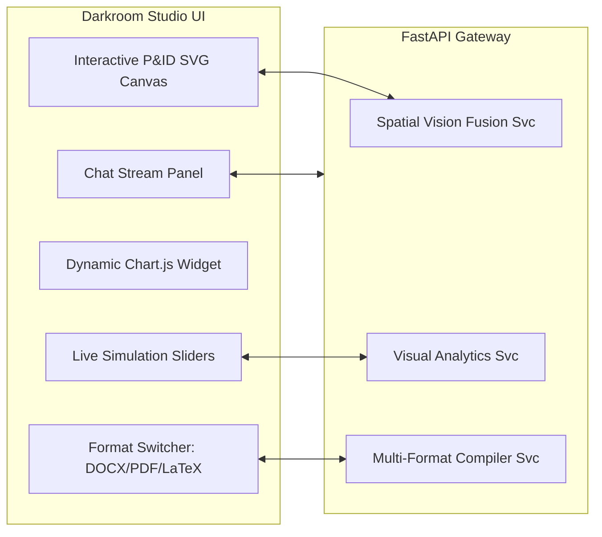

# 🎨 Phase 2 Transformation: Spatial Multi-Modal Fusion & Visual Analytics
**Document Code:** `docs/future_updates/PHASE_2_TRANSFORMATION.md`  
**System:** Sovereign On-Premise AI Workbench (SIH26117)  
**Objective:** Elevate user experience from plain text to an interactive industrial command center with dynamic visual canvases, charts, and document compilers.

---

## 1. Executive Summary

Phase 2 transforms the user interaction model:
1. Replaces static text explanations with **dynamic visual charts** (bar, pie, heatmaps for downtime & energy OPEX).
2. Introduces an **Interactive SVG P&ID Canvas** with dynamic tag highlighting and live simulation sliders.
3. Implements **Hybrid Spatial Grounding**, fusing PaddleOCR bounding boxes with Qwen2-VL semantic recognition.
4. Adds an **air-gapped multi-format document compiler** generating publication-grade `.docx`, `.pdf`, `.tex`, and `.html` dossiers.

---

## 2. Detailed Technical Deliverables

### Deliverable 2.1: Interactive Visual Analytics Engine
- **Problem:** Refinery executives and process engineers cannot evaluate downtime penalties or steam consumption from walls of text.
- **Implementation:**
  - Build `AnalyticsAgent` and `EconomicsAgent` tool that outputs structured chart specifications:
    ```json
    {
      "type": "chart",
      "chartType": "stacked_bar | doughnut | heatmap | line",
      "title": "MRPL Crude Unit - Downtime Financial Impact Analysis",
      "labels": ["Hours 1-4", "Hours 5-8", "Hours 9-12", "Hours 13-24"],
      "datasets": [
        {"label": "Direct Crude Throughput Loss (USD)", "data": [80000, 160000, 240000, 480000], "color": "#f59e0b"},
        {"label": "Flare & Steam Utility Waste (USD)", "data": [12000, 24000, 36000, 72000], "color": "#ef4444"}
      ],
      "unit": "USD ($)"
    }
    ```
  - Integrate a dedicated `ChartRenderer.tsx` component in the frontend using Chart.js / Recharts.
  - Support hover tooltips, dataset toggling, and 1-click SVG/PNG export.

### Deliverable 2.2: Interactive P&ID Canvas & Simulation Sliders
- **Problem:** Engineers must visually cross-reference schematics and want to test "what-if" scenarios.
- **Implementation:**
  - Build `PIDCanvas.tsx` with smooth pan, zoom, and SVG layer overlays.
  - When the user asks about an equipment tag (e.g. `PRV-102` or `Boiler Drum B-401`):
    - Query `PIDCanvasAgent` for normalized coordinates `[ymin, xmin, ymax, xmax]`.
    - Canvas smoothly animates to center on the component, highlighting it with an animated amber beacon.
  - **Live Simulation Slider Enclave:**
    - Render a real-time parameter slider in the artifact view:
      * *Temperature Slider:* $300^\circ\text{C} \longleftrightarrow 550^\circ\text{C}$
      * *Design Pressure Slider:* $10\text{ bar} \longleftrightarrow 30\text{ bar}$
    - Moving the slider recalculates the ASME allowable stress curve and wall thickness in real time via the local Python engine without needing full LLM regeneration.

### Deliverable 2.3: Hybrid Spatial Vision Fusion (PaddleOCR + Qwen2-VL)
- **Problem:** Pure OCR misses engineering semantics; pure VLMs hallucinate coordinate positions.
- **Implementation:**
  - Concurrent pipeline via `asyncio.gather`:
    1. Worker A (`.venv-cv`): PaddleOCR extracts 2D polygon bounding boxes for all text tags.
    2. Worker B (Ollama): Qwen2-VL extracts semantic relationships (e.g., *valve PRV-102 is connected to bypass line L-304*).
  - Fusion Algorithm: Calculates Intersection over Union (IoU) between VLM bounding predictions and PaddleOCR exact coordinates to produce high-precision grounded spatial entities.

### Deliverable 2.4: Multi-Format Engineering Document Compilers
- **Problem:** Field engineers need formal compliance dossiers ready for regulatory submission (OISD / ASME).
- **Implementation:**
  - Implement `ai_engine/tools/multi_format_doc_generator.py` using:
    - `python-docx` for editable Microsoft Word `.docx` documents.
    - `WeasyPrint` for styled, publication-ready `.pdf` with header/footer pagination.
    - `pylatex` for rigorous mathematical `.tex` papers with embedded KaTeX formulas.
    - Standalone single-file `.html` with embedded CSS for offline browser viewing.

---

## 3. Phase 2 Architecture Diagram



---

## 4. Phase 2 Acceptance Criteria

- [ ] **Interactive Visuals:** All economic impact calculations produce interactive Chart.js widgets directly in the UI.
- [ ] **Canvas Grounding:** Querying an instrument tag animates the P&ID canvas and highlights the equipment with $<5\%$ coordinate error.
- [ ] **Real-Time Sliders:** Adjusting temperature/pressure sliders recomputes stress curves at $\ge 30\text{ fps}$ without network lag.
- [ ] **Document Export:** 1-click export produces valid, beautifully styled `.pdf`, `.docx`, and `.tex` documents without external internet tools.
