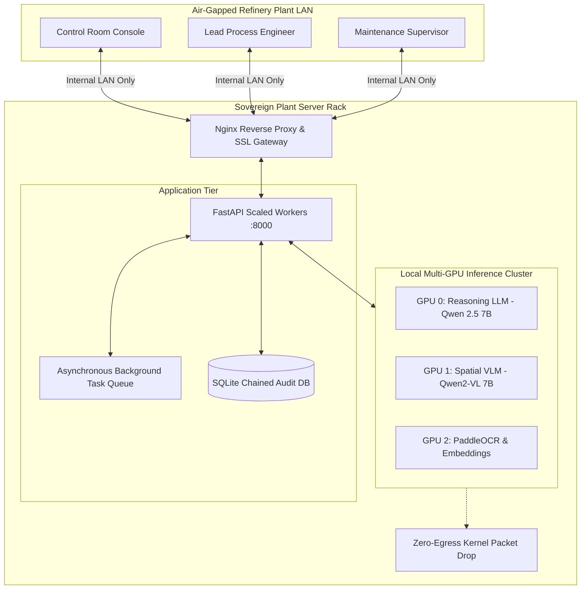

# 🏢 Phase 3 Transformation: Enterprise Production, Scalability & Hardened Security
**Document Code:** `docs/future_updates/PHASE_3_TRANSFORMATION.md`  
**System:** Sovereign On-Premise AI Workbench (SIH26117)  
**Objective:** Deliver an air-gapped, scalable, and audit-compliant production system ready for permanent enterprise deployment in high-hazard industrial facilities.

---

## 1. Executive Summary

Phase 3 transitions the workbench from an engineering workstation tool into a **centralized, high-availability, industrial plant command center**:
1. **Multi-User Scalability:** Scales to support 50+ concurrent plant engineers across shift rotations using decoupled inference queues.
2. **Hardened Air-Gap & Zero-Egress:** Enforces network isolation at the OS kernel/socket layer with cryptographic audit trails.
3. **Adversarial Resilience:** Neutralizes indirect prompt injection attacks embedded inside scanned vendor blueprints.
4. **Turnkey Offline Packaging:** Delivers a 1-click self-contained installation package for completely air-gapped industrial servers.

---

## 2. Detailed Technical Deliverables

### Deliverable 3.1: Enterprise High-Availability & Inference Scalability
- **Problem:** When multiple engineers run queries simultaneously, single-instance Ollama queues bottleneck and VRAM conflicts cause latency spikes.
- **Implementation:**
  - **Decoupled Inference Backend (vLLM / Multi-Ollama Cluster):**
    - Support multi-GPU load balancing across multiple local GPU cards (e.g. 2x or 4x RTX 4090 / A5000).
    - Dedicated model pinning: GPU 0 dedicated to Reasoning LLM (`qwen2.5:7b`), GPU 1 dedicated to Spatial VLM (`qwen2-vl:7b`) and Embeddings.
  - **Asynchronous Task Queue (Celery / ARQ with Redis/SQLite):**
    - Long-running operations (such as compiling 100-page P&ID blueprint folders into vector embeddings) execute asynchronously in the background.
    - Frontend receives live progress bars over WebSocket without blocking interactive chat sessions.

### Deliverable 3.2: Kernel-Level Zero-Egress Enforcement & Tamper-Evident Auditing
- **Problem:** Enterprise security teams require mathematical and forensic proof that zero bytes can leave the network.
- **Implementation:**
  - **Kernel / Socket-Level Firewall Hooks:**
    - On Linux: Configured via `iptables` / `nftables` blocking all non-loopback outbound traffic (`OUTPUT -d 127.0.0.1 -j ACCEPT; OUTPUT -j DROP`).
    - On Windows: Windows Filtering Platform (WFP) policy script installed by the installer.
  - **Cryptographic SHA-256 Merkle Audit Chain:**
    - Every prompt, tool execution, SymPy formula proof, and artifact export is hashed with its previous entry's hash.
    - Exportable as a cryptographically signed compliance dossier (`audit_trail.json`) for OISD-156 and OSHA audits.

### Deliverable 3.3: Indirect Prompt Injection Defense Enclave
- **Problem:** Malicious or rogue contractors uploading modified maintenance logbooks with hidden prompts to bypass safety thresholds.
- **Implementation:**
  - Multi-stage document sanitizer before embedding:
    1. **Visual Scan Filter**: Strips zero-width characters, hidden fonts, and invisible text layers.
    2. **Adversarial Classifier (Tier 1 SLM)**: Rapidly scans chunks for instruction-override patterns (`IGNORE PRIOR INSTRUCTIONS`, `SYSTEM PROMPT:`, `ADMIN MODE`) and quarantines suspicious documents.
    3. **Deterministic Constraint Engine**: Hard-coded safety limits (e.g., minimum wall thickness cannot drop below $10.0\text{ mm}$ regardless of LLM recommendations).

### Deliverable 3.4: 1-Click Air-Gapped Offline Installer Bundle
- **Problem:** Installing dependencies in a high-security refinery where machines have no internet access.
- **Implementation:**
  - Self-extracting offline deployment bundle containing:
    - Pre-packaged portable Python 3.14 and Python 3.11 runtimes.
    - Pre-cached Python wheels for all dependencies (FastAPI, LangGraph, PaddleOCR, PyMuPDF, WeasyPrint).
    - Pre-quantized GGUF model weights (`qwen2.5-7b`, `qwen2-vl-7b`, `nomic-embed`).
    - Pre-compiled React 19 production build (`dist/`).
    - Automated setup scripts: `install_offline.bat` (Windows) and `install_offline.sh` (Linux).
  - Completes setup in under 5 minutes without touching any external network.

---

## 3. Production Architecture Diagram

---

## 4. Phase 3 Acceptance Criteria & Compliance Milestones

- [ ] **Zero-Egress Audit:** Network packet capture (`tcpdump` / Wireshark) confirms 0 bytes egress during heavy multimodal workloads.
- [ ] **Multi-User Load:** Gateway handles 20 concurrent WebSocket streaming sessions with average response latency $<2.5\text{ seconds}$.
- [ ] **Tamper Detection:** Automated test demonstrates that altering a single character in `audit.db` breaks the SHA-256 Merkle chain and triggers a security alert.
- [ ] **Turnkey Offline Deployment:** Clean virtual machine with network disabled successfully installs and boots the workbench in $<5\text{ minutes}$ using `install_offline.bat`.
